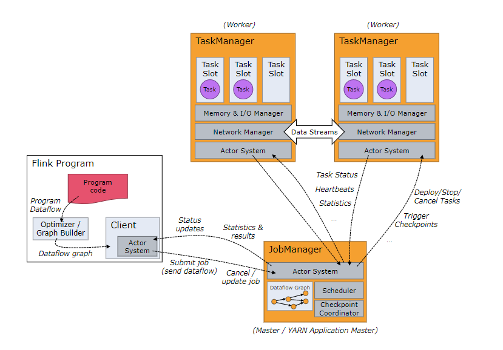
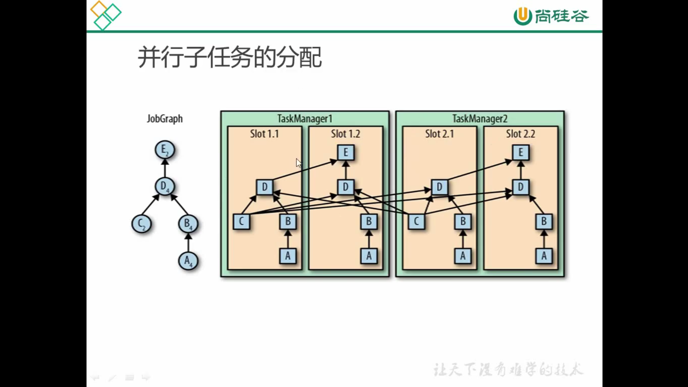

### Flink 术语

Flink 是用于对无界和有界数据流进行状态计算的分布式处理引擎。

- **Flink 集群**

  Flink 集群是由 `JobManager` 和 `TaskManager` 进程组成的分布式系统。

- **Flink 应用**

  Flink 应用是提交 Flink Job 的应用程序，Job 的提交通常在执行环境中调用 `execute` 方法完成。Job 可以提交到 `Session Cluster`， `Application Cluster` 或者 `Job Cluster`。

- **Job**

  Job 是逻辑图(数据流图)的运行时表示，通过 Flink 应用程序的 `execute` 方法创建和提交。

- **Logical Graph**

  逻辑图是一种有向图，其中节点是 `Operator`，边为定义运算符的输入/输出关系并且关联数据流或者数据集，也称为数据流图(`Dataflow Graph`)。逻辑图通过从 Flink 应用程序提交 Job 时创建。

- **Physical Graph**

  物理图是逻辑图转换为在分布式运行时中执行的结果，也称为执行图(`Execution Graph`)。物理图的节点是 `Task`，边表示数据流或数据集的输入/输出关系或分区。

- **Operator**

- **Operator Chain**

- **Partition**

- **Task**

  `Task` 是 Flink 运行时最小的计算单元，每个 `Task` 封装一个 `Operator` 或者 `Operator Chain` 的并行实例。

- **SubTask**

  `SubTask` 是负责处理数据流的一个分区的 `Task`，使用 `SubTask` 是用于强调 `Operator` 或者 `Operator Chain` 存在多个并行的 `Task`。

### Flink 运行时架构

作为分布式系统，Flink 需要有效的分配和管理计算资源以执行流式应用程序。

Flink 的运行时由两种类型的进程组成：**JobManager** 和 **TaskManager** 。JobManager 和 TaskManager 可以以多种模式运行：standalone，容器，资源管理器。

Client 不是运行时和程序执行的一部分，它用于准备数据流并将其发送到 JobManager，之后客户端可以断开连接(detached mode) 或者保持连接以接收进度报告(attached mode)。Client 要么作为触发执行的程序的一部分运行，要么在命令行 `./bin/flink`

#### JobManager

JobManager 负责协调应用程序的分布式执行，包括任务的调度、任务执行成功或失败处理、协调检查点以及故障恢复等。JobManager 主要由三个部分组成：

- **ResourceManager** 

  *ResourceManager* 负责分配和回收 Flink 集群中的资源，Flink 集群中资源调度最小的单位是 **task slot**。Flink 为不同的环境和资源实现了不同的 ResourceManager，例如 YARN, Kubernetes 和 standalone 等部署模式。在 standalone 模式中，ResourceManager 只能分发 TaskManager 可用的 slot 而不能启动新的 TaskManager。

- **Dispatcher**

  *Dispatcher* 提供了 REST 接口用来提交需要运行 Flink 应用程序，并为每个提交的作业启动一个新的 JobManager。Dispatcher 还提供了 WebUI 用于展示任务执行的信息。

- **JobMaster**

  `JobMaster` 负责管理单个 Job 流程的执行，Flink 集群可以同时运行多个 Job，每个 Job 有一个 `jobMaster`

Flink 集群中至少有一个 `jobManager`，在高可用的部署中会存在多个 `jobManager`，其中一个作为 leader，而其他的则作为 standby。

JobManager 接收需要执行的应用程序，其中包括 JobGrap， Logic Graph 和应用程序的 jar 包。JobManager 会把 JobGraph 转换成一个物理层面的 Physical Graph（执行图） 包含了所有可以并发执行的任务。JobManager 会向 ResourceManager 请求执行任务必要的资源，也就是 TaskManager 上的 Slot，一旦获取到足够的资源就会将执行图分发到真正运行它们的 TaskManager 上，在运行的过程中，JobManager 会负责所有需要中央协调的操作，比如检查点(checkpoints) 的协调。

#### TaskManager

`TaskManager` 负责数据流任务的执行，并且缓存和交换数据流。Flink 集群中至少有一个 `TaskManager`，其最小的资源调度单位是 slot，TaskManager 中 slot 的数量表示当前正在处理的 Task 数，可以在一个 Task 里面执行多个操作。

每个 `TaskManager` 是一个 JVM 进程，可以在一个线程执行多个子任务，通过 slot 可以控制 `TaskManager` 可以接收的任务的数量。

每个 slot 表示 `TaskManager` 中资源的一个子集，划分 slot 意味着子任务的运行不会抢占其他 Job 的子任务的内存，CPU 并没有隔离。

通过调整任务的 slot 数量，可以定义子任务的隔离。每个 `TasManager` 定义一个 slot 则表示每个任务组在一个单独的 JVM 进程中运行；有多个 slot 表示多个子任务共享同一个 JVM，同时也共享 JVM 连接和心跳消息。

默认情况下，Flink 允许不同任务的子任务共享 slot，只要这些任务来自同一个 Job，也就是一个 slot 运行整个 Job 的全部流程

TaskManager 是 Flink 中的工作进程，Flink 中通常会有多个 TaskManager 运行，每个 TaskManager 包含一定数量的 Slot，Slot 的数量限制了 TaskMananger 能够执行的任务数量。Flink 集群启动之后，TaskManager 会向资源管理器注册 Slot，收到资源管理器的指令后，TaskManager 会将一个或者多个 Slot 提供给 JobMananger 调用，JobManager 就可以向 Slot 分配 Task 来执行。在执行过程中，一个 TaskManager 可以跟其他运行同一个应用程序的 TaskManager 交换数据。

#### Task Slots

Flink 中每个 TaskManager 都是一个 JVM 进程，它可能会在独立的线程上执行一个或多个子任务。为了控制一个 TaskManager 能接收多少 task，TaskManager 通过 task slot 来进行控制

一个 Operator 的子任务(subtask) 的个数被称为并行度(parallelism)，一个 stream 的并行度可以认为是其所有算子中最大的并行度。

### Flink 运行模式

#### Session Cluster

A long-running [Flink Cluster](https://ci.apache.org/projects/flink/flink-docs-release-1.11/concepts/glossary.html#flink-cluster) which accepts multiple [Flink Jobs](https://ci.apache.org/projects/flink/flink-docs-release-1.11/concepts/glossary.html#flink-job) for execution. The lifetime of this Flink Cluster is not bound to the lifetime of any Flink Job. Formerly, a Flink Session Cluster was also known as a Flink Cluster in *session mode*. Compare to [Flink Application Cluster](https://ci.apache.org/projects/flink/flink-docs-release-1.11/concepts/glossary.html#flink-application-cluster).

Session Cluster 模式需要先启动集群，然后再提交作业并向集群申请资源，如果资源不足则会等待直到资源充足。所有的 Job 共享 `Dispachter` 和 `ResourceManager`，适合规模较小执行时间短的 Job。

#### Job Cluster

A Flink Job Cluster is a dedicated [Flink Cluster](https://ci.apache.org/projects/flink/flink-docs-release-1.11/concepts/glossary.html#flink-cluster) that only executes a single [Flink Job](https://ci.apache.org/projects/flink/flink-docs-release-1.11/concepts/glossary.html#flink-job). The lifetime of the [Flink Cluster](https://ci.apache.org/projects/flink/flink-docs-release-1.11/concepts/glossary.html#flink-cluster) is bound to the lifetime of the Flink Job.

每个 Job 对应一个集群，每提交一个 Job 会根据自身的情况单独申请资源直到 Job 完成，Job 的执行并不会影响其他 Job 的运行，每个 Job 独享 Dispatcher 和 ResourceManager，适合规模大长时间运行的 Job。

#### Application Cluster

A Flink Application Cluster is a dedicated [Flink Cluster](https://ci.apache.org/projects/flink/flink-docs-release-1.11/concepts/glossary.html#flink-cluster) that only executes [Flink Jobs](https://ci.apache.org/projects/flink/flink-docs-release-1.11/concepts/glossary.html#flink-job) from one [Flink Application](https://ci.apache.org/projects/flink/flink-docs-release-1.11/concepts/glossary.html#flink-application). The lifetime of the [Flink Cluster](https://ci.apache.org/projects/flink/flink-docs-release-1.11/concepts/glossary.html#flink-cluster) is bound to the lifetime of the Flink Application.

### Flink 部署

#### Docker

#### Kubernetes

#### HA

### Job

#### Job 提交

#### 任务调度

参考：

- [Flink 术语](https://ci.apache.org/projects/flink/flink-docs-release-1.11/concepts/glossary.html#flink-session-cluster)

