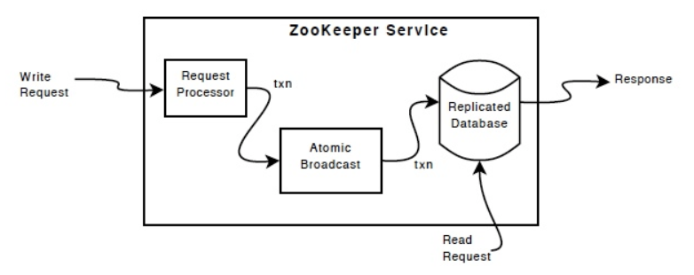

## ZooKeeper

ZooKeeper 是一个用于分布式应用的高性能协调服务，以简单的接口提供了命名、配置管理、同步和组管理等服务，利用这些服务可以实现一致性、组管理、leader 选举等功能。

作为一个分布式协调服务，ZooKeeper 具有如下特性：

- **简单**：ZooKeeper允许分布式进程通过共享的层级命名空间相互协调，该命名空间与标准文件系统类似地组织。命名空间由 Znode 组成，这些 Znode 与文件和目录类似，和用于存储的文件系统不同，ZooKeeper 的数据存储在内存中，这使得 ZooKeeper 可以实现高吞吐和低延迟
- **多副本**：与其协调的分布式进程一样，ZooKeeper 本身也可以在集群中的主机间复制。ZooKeeper 集群中的节点在内存中维护了数据状态的镜像，并且持久化存储了事务日志和快照。客户端和集群中的一个节点建立 TCP 连接，并通过这个连接发送请求、接收响应、监听事件以及发送心跳
- **有序**：ZooKeepr 为每个更新操作增加代表事务顺序的编号，后续的操作可以使用这个顺序实现更加高级别的抽象，例如同步原语
- **快速**：ZooKeeper 非常适合读多写少的负载情况，在读写比大概 10:1 的情况下性能最好

ZooKeeper的性能方面意味着它可以在大型分布式系统中使用，可靠性方面使其不会成为单点故障，严格的排序意味着可以在客户端实现复杂的同步原语。

ZooKeeper 非常简单且快速，作为构建复杂服务的基础服务，其提供了一系列的保证：

- 顺序一致性(Sequential Consistency)：客户端的更新操作将按照发送的顺序执行
- 原子性(Atomicity)：更新操作要么成功，要么失败，没有中间状态
- 单系统映像(Single System Image)：无论客户端连接到那个服务器，看到的都是相同的视图，也就是说即使客户端在同一会话中由于服务器故障而转移到其他服务器，也不会看到旧的系统视图
- 可靠性(Reliability)：一旦更新操作执行，数据会一直存在知道下一次的更新覆盖
- 低延时(Timeliness)：系统保证在一定时间范围内的延迟后，客户端能够看到最新的数据

### 组件

ZooKeeper 服务包含三个组件：请求处理器(Request Processor)、原子广播器(Atomic Broadcast) 和 副本数据库(Replicated Database)。



副本数据库是一个内存数据库，它包含了整个树形结构的数据，更新操作会以日志的方式记录到磁盘用于恢复，而写操作则会在应用到内存数据库之前序列化到磁盘。

客户端可以连接任意一个 ZooKeeper 服务器，并通过连接的服务器发送请求。读请求的数据由每个服务器关于内存数据库的本地副本提供，更改状态的请求和写请求则需要通过协议来处理。

ZooKeeper 服务器集群包含一个 leader 节点和多个 follower 节点，客户端的写请求都会被转发到 leader 节点，leader 节点将处理结果广播给所有的 follower 节点并达成一致从而完成写操作。

ZooKeeper 使用自定义的原子消息传递协议，原子消息使得 ZooKeeper 可以保证本地副本的一致性。当 leader 接收到一个写请求时会计算出请求执行后系统的状态，并将其转换成一个事务来捕获这个新状态。


ZooKeeper 提供了非常简单易用的编程接口，其支持如下操作：

- `create`：在数据树中创建一个节点
- `delete`：删除数据树中的一个节点
- `exists`：判断节点是否存在
- `get`：获取节点包含的数据
- `set`：写数据到一个节点
- `children`：获取一个节点的子节点列表
- `sync`：同步数据

### 数据模型
ZooKeeper 提供的分层名称空间很像分布式文件系统，命名空间的名称是由斜杠(/) 分隔的路径序列。与文件系统不同的是，ZooKeeper 命名空间中的每个节点都可以包含与之关联的数据以及子节点，这就像一个既可以是文件也可以是目录的文件系统。

#### ZNode
ZooKeeper 树形结构中的节点称为 Znode，其维护一个 stat 结构，包含数据更改的版本号、ACL 更改和时间戳等信息用于缓存验证以及协调更新。

每次 Znode 更新数据时，版本号都会增加，在客户端获取数据的同时也会获取到数据的版本号，当客户端执行更新或者删除操作时必须提供当前 Znode 的版本号，如果版本号不匹配则更新失败。

Znode 的读写是原子的，读操作获取 Znode 的全部数据，写操作将会覆盖所有的原始数据，每个数据节点都有一个访问控制列表(ACL) 用于权限控制。

ZooKeeper 设计用于存储协调数据，如状态信息、配置、位置信息等，因此存储在每个节点的数据通常很小(1M 以内)，ZooKeeper 客户端和服务器会对数据进行检查以确保 znode 上的数据少于 1M。较大数据量的操作在网络传输和磁盘存储上需要消耗更多的时间，影响整体的性能。

ZooKeeper 实现了多种不同特性的 Znode，这些特性可用于实现更加高级的功能：

- **临时节点(Ephemeral Node)**：临时节点只有在会话处于活动状态时存在，会话结束时节点就会被删除。这种特性使得临时节点不能有子节点
- **顺序节点(Sequence Node)**：顺序节点在创建时会在路径的末尾附加一个单调递增的计数器，此计数器对于父节点来是唯一的。计数器是一个 4 字节的无符号整数，因此一个节点下的顺序节点数不能超过 `2^31 - 1` 个。
- **容器节点(Container Node)**：容器节点的最后一个子节点被删除后，该节点就会被服务器在某个时刻删除，可以用于分布式锁、leader 选举等场景。由于容器节点的特性，在创建容器节点的子节点时需要检查 `KeeperException.NoNodeException`，并且在捕获异常后重新创建容器节点
- **TTL 节点(TTL Node)**：在创建持久节点和顺序持久节点时，可以为这些节点设置一个以毫秒为单位的生存周期(TTL)，如果这些节点没有子节点并且在生存周期内没有修改，那么服务器将会在某个时刻删除该节点。节点的 TTL 特性默认是禁用的，需要在启动服务之前配置，没有启用 TTL 时创建 TTL 节点会抛出 `KeeperException.UnimplementedException`

#### Time

ZooKeeper 的 Znode 中的数据包含多个时间，这些时间在 ZooKeeper 中有非常重要的作用：

- **Zxid** ：ZooKeeper 状态的每次更改都会以 zxid（ZooKeeper Transaction Id）标记，通过 zxid 可以得到 ZooKeeper 所有状态变更的总排序。每个更改都有一个唯一的zxid，如果zxid1小于zxid2，则zxid1发生在zxid2之前
- **Version numbers** ：Znode 数据结构中包含三个版本字段：version, cversion, aversion，对节点的每次更改都会导致该节点的某个版本号增加
- **Ticks** ：ZooKeeper 集群的服务器之间使用 ticks 来定义事件的时间，tick 仅通过最小会话超时（tick 的2倍）间接暴露，如果客户端请求的会话超时小于最小会话超时，则服务器将告诉客户端会话超时实际上是最小会话超时

#### Stat

Stat 是 Znode 中保存的数据结构，其除了包含存储的数据外，还有一些其他的字段：

- czxid：导致 znode 创建的状态变更 zxid
- mzxid：znode 最后修改的状态变更 zxid
- pzxid：znode 最后修改子节点的状态变更 zxid
- ctime：从创建 znode的 epoch 开始的时间（以毫秒为单位）
- mtime：上次修改此znode时的时间（以毫秒为单位）
- version：znode 数据的更改次数
- cversion：znode的子节点的更改数
- aversion：znode的ACL更改次数
- ephemeralOwner：如果znode是短暂节点，则此znode的所有者的会话ID；如果它不是一个短暂的节点，它将为零
- dataLength：此znode的数据字段的长度
- numChildren：此znode的子节点数

#### ACL

### Session

ZooKeeper 通过创建服务句柄与 ZooKeeper 服务建立会话，句柄创建之后就处于 `CONNECTING` 状态并尝试与集群中的任意一个节点建立连接，如果连接成功则会切换到 `CONNECTED` 状态，否则切换到 `CLOSE` 状态。三种状态在不同的情况下会互相切换：

- `CONNECTING -> CONNECTED	`：连接成功触发 `CONNECTED` 事件
- `CONNECTING -> CLOSE`：连接认证失败触发 `AUTH_FAILED` 事件，会话超时触发 `SESSION_EXPIRED` 事件，句柄关闭
- `CONNECTED -> CONNECTING`：连接失败触发 `DISCONNECTED`事件
- `CONNECTED -> CLOSE`：句柄关闭

客户端创建会话需要以 `<ip>:<port>,<ip>:<port>` 的方式提供所有服务节点的信息，ZooKeeper 客户端将选择任意服务器并尝试连接，如果连接失败或者连接断开会自动尝试连接其他服务节点知道重新创建连接。

创建会话时也可以使用 `<ip>:<port>/path/of/user` 来表示该会话的所有操作都在此目录下，这个功能在多租户的情况下比较有用 。


#### 

### Watch

ZooKeeper 支持 watch 的概念，客户端可以在 znode 上设置 watch，当 znode 上 watch 的事件触发时，客户端会收到一个通知 znode 发生改变的数据包。

znode 上设置的 watch 是一次性的，也就是在触发之后就被删除，客户端需要重新设置 watch 才会继续监听。***3.6.0 版本提供了一个新的特性，即客户端可以在 znode 上设置永久的、递归的 watch，这些  watch 在触发后不会被删除。***


当设置了 Watch 的节点的数据变更，就会触发一次性的 Watch 事件并发送给设置该 Watch 的客户端。Zookeeper 的所有读操作(如 getData, getChildren, exists)都可以对节点设置 Watch。

Watches 在 ZooKeeper 客户端连接的 server 端的本地维护。当客户端断开与 server 的连接时将收不到任何 Watch，当客户端重新连接上 server，所有之前注册的 Watch 将被重新注册并在需要的时候触发。

Watch 事件有关键点：
- Watch 事件是一次性触发的；当设置了 Watch 的节点数据发生变化就会立即触发 Watch 事件并发送给客户端，但是当该节点再次发生变更时，除非在该节点重新设置了 Watch，否则 Watch 事件不会再次被触发
- Watch 事件是异步发送的，也就是在更改成功的响应返回到客户端时 Watch 事件可能还没有到达客户端。但是 ZooKeeper 提供了顺序保证：客户端只有看到了 Watch 事件，才能看到对该节点的更改响应。
- 设置 Watch 的节点数据变更有两种方式：当前节点数据变更和子节点变更；因此 Watch 事件可以看作 data watch 和 child watch。setData() 将会触发 data watch；create() 将触发当前节点的 data watch 和父节点的 child watch；delete() 将会触发当前节点的 data watch 和父节点的 child watch。

#### Watch 事件
当读取 ZooKeeper 的状态时可以设置 Watch，当 Watche 触发时会生成相应的事件：
- Created evetn - 调用 exists() 时激活
- Deleted event - 调用 exists()，getData()，getChildren() 时激活
- Changed event - 调用 exists()，getData()，getChildren() 时激活
- Child event - 调用 getChildren() 时激活
- Child Remove event - 调用getChildren() 时添加，在 Watch 移除时触发
- Data Remove event - 调用 exist() 或 getData() 时添加，在 Watch 移除时触发

#### ZooKeeper Watch 保证
- Watch 相对于其他事件、其他 watch 和异步恢复而言是有序的；ZooKeeper 客户端保证所有的分发是按顺序的
- 客户端在看见新数据之前一定会看到 Watch 事件
- ZooKeeper 的 Watch 事件的顺序和数据更改的顺序一致

#### ZooKeeper Watch 要点
- Watch 是一次性触发的，如果已经收到 Watch 事件之后想再次感知数据变化则必须再次设置 Watch
- Watch 触发到再次设置 Watch 之间有可能会有多次数据变更

## zookeeper 集群搭建
```
# The number of milliseconds of each tick
tickTime=2000
# The number of ticks that the initial 
# synchronization phase can take
initLimit=10
# The number of ticks that can pass between 
# sending a request and getting an acknowledgement
syncLimit=5
# the directory where the snapshot is stored.
# do not use /tmp for storage, /tmp here is just 
# example sakes.
dataDir=/tmp/zookeeper
# the port at which the clients will connect
clientPort=2181
# the maximum number of client connections.
# increase this if you need to handle more clients
#maxClientCnxns=60
# server.A=B:C:D
# A means myid; B means node name; C means port for communicating with follower and leader; D means port for leader election
server.1=zoo1:2888:3888
server.2=zoo2:2888:3888
server.3=zoo3:2888:3888
```

ZooKeeper 解决了分布式系统中的一些最基础的问题：
- 提供极低延迟、超高可用的内存 KV 数据库服务
- 提供中心化的服务故障发现服务
- 提供分布式场景下的锁、Counter、Queue 等协调服务

ZooKeeper 节点内数据组织为树状结构，数据存储在每一个树节点(ZNode)上，可以根据数据路径获取对应的数据：
```
get /path/of/znode
```

ZooKeeper 使用 ZAB 协议保证多个节点的数据一致性，数据存储在 ZNode 上，ZooKeeper 数据树节点可以设置多种节点类型，每种节点类型具有不同的节点特性：
- 持久节点(PERSISTENT)：节点创建后就一直存在，直到有删除操作来主动清除这个节点
- 临时节点(EPHEMERAL)：临时节点的生命周期和客户端 session 绑定，如果客户端 session 失效，那么节点会被自动清理掉，session 失效并不一定是连接断开。在临时节点下面不能创建子节点。
- 持久顺序节点(PERSISTENT_SEQUENTIAL)：具有持久性和顺序性，也就是说节点具有持久节点的特性，并且在同一个父节点下的节点有先后顺序，具体是在节点名称后增加一个自增的数字
- 临时顺序节点(EPHEMERAL_SEQUENTIAL)：具有临时性和顺序性，也就是说节点具有临时节点的特性，并且在同一个父节点下有先后顺序

ZooKeeper 为 ZNode 实现了 Watcher 机制，当在 ZNode 上设置了 watch，则节点的变化会异步的反馈给客户端：
- watcher 设置：ZooKeeper 可以为所有的读操作设置 watcher。其中 getChildren() 设置的 watcher 关注子节点的创建、更新、删除等事件；exist() 和 getData() 设置的 watcher 关注当前节点的创建、更新、删除等
- watcher 触发反馈：ZooKeeper 的客户端和服务器端是长连接，watcher 时间发生后服务器端会发送一个信息给客户端，客户端会调用预先准备号的处理逻辑进行应对
- watcher 特性：watcher 事件是一次性的触发器，当设置了 Watch 的节点数据发生变化就会立即触发 Watch 事件并发送给客户端，但是当该节点再次发生变更时，除非在该节点重新设置了 Watch，否则 Watch 事件不会再次被触发

ZooKeeper 在启动时，客户端会根据配置文件中 ZooKeeper 服务器列表配置项选择其中任意一台服务器相连，如果连接失败则会尝试连接另外一台服务器直到连接成功。一旦建立连接，ZooKeeper 就会为该客户端创建一个新的 session，每个 session 都有一个超时时间设置，如果 ZooKeeper 服务器在超时时间内没有收到任何请求，则相应的 session 就会过期，于是与该 session 相关的所有临时节点将会被清理，注册在上面的事件就会被触发。

ZooKeeper 对于网络连接断开和 session 过期是两种不同的处理机制。客户端与服务器之间维持的是长连接，在 session 超时时间内，服务端会不断检测客户端是否处于正常连接，服务端会将客户端的每次操作视为一次有效的心跳检测来反复进行 session 激活，因此在正常情况下 session 是一直有效的。

当客户端和服务器端断开连接后，如果是在超时时间内则客户端会收到 CONNECTION_LOSS 异常，此时客户端会自动从 ZooKeeper 集群中选择其他的节点连接，如果在超时时间内重新连接，则 session 的状态为 CONNECTED；如果在超时时间内没有连接上，则 session 的状态变为 EXPIRED。一旦服务器端认为 session 过期则会删除当前 session 关联的临时节点并通知监听了这些节点的其他 session，此时由于当前客户端处于断开连接状态，所以并不能收到通知，当再次连接上集群后就会收到 SESSION-EXPIRED 异常，此时需要重新创建一个 session。


