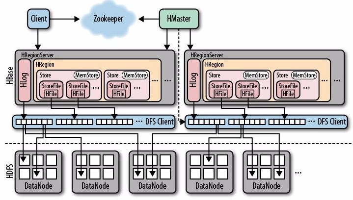

### 架构

HBase 借鉴了 BigTable 论文，是典型的 Master-Slave 模型。Master 节点负责管理集群，RegionServer 节点负责处理读写请求。HBase 的数据最终存储在 HDFS 上，并且使用 ZooKeeper 用于协助 Master 管理集群。


#### 客户端

HBase 客户端提供了 Shell 命令行接口、原生 Java API 编程接口、Thrift/REST API 编程接口以及 MapReduce 编程接口。HBase 客户端支持所有常见的 DML 操作以及 DDL 操作，其中 Thrift/REST API 主要用于支持非 Java 的上层业务需求，MapReduce 接口主要用于批量数据导入以及批量数据读取。

HBase 客户端访问数据之前，需要先通过元数据表 (hbase:meta) 定位目标数据所在 RegionServer，之后才会发送请求到该 RegionServer，同时元数据表中的数据将会被缓存在客户端本地，以方便之后的请求访问。如果集群中 RegionServer 发生宕机或者执行了负载均衡导致数据分片发生迁移，则客户端需要重新请求最新的元数据并缓存在本地。

#### ZooKeeper

ZooKeeper 是基于 Google 的 Chubby 开源实现，主要用于协调管理分布式应用程序。在 HBase 系统中，ZooKeeper 扮演着非常重要的角色：
- **实现 Master 高可用**：系统中一般有一个 active Master 和多个 standby Master，一旦 active Master 宕机，ZooKeeper 就会检测到宕机事件，然后通过选举机制从 standby Master 中选举出新的 Master 作为 active Master 完成切换，保证系统的可用性
- **管理系统核心元数据**：ZooKeeper 中保存着系统元数据表 hbase:meta 所在的 RegionServer 地址，同时 ZooKeeper 中也管理着当前系统中正常工作的 RegionServer 集合
- **参与 RegionServer 宕机恢复**：ZooKeeper 通过心跳可以感知到 RegionServer 是否宕机，并通知 Master 对宕机的 RegionServer 做分片迁移
- **实现分布式锁**：HBase 中对一张表进行各种管理操作需要先加表锁，ZooKeeper 可以通过其特定的机制实现分布式表锁

#### Master

Master 主要负责 HBase 系统的各种管理工作：
- 处理用户的各种管理请求，如建表、修改表、切分表、合并数据分片等
- 管理集群中所有 RegionServer，包括 RegionServer 中 Region 的负载均衡、RegionServer 的宕机恢复以及 Region 的迁移等
- 清理过期日志以及文件，Master 会每隔一段时间检查 HDFS 中 HLog 是否过期、HFile 是否已经被删除，并在过期之后将其删除

#### RegionServer

RegionServer 主要用来响应用户的 IO 请求，由 WAL(HLog)、BlockCache 以及多个 Region 构成。
- **WAL(HLog)**：HLog 在 HBase 中有两个核心作用：
  - 用于实现数据的高可靠性，HBase 数据随机写入时并非直接写入 HFile 数据文件，而是先写入缓存(MemStore)，然后再异步刷新落盘。为了防止缓存数据丢失，数据写入缓存之前需要首先顺序写入 HLog，这样即使缓存数据丢失，仍然可以通过 HLog 日志恢复
  - 用于实现 HBase 集群间主从复制，通过回放主集群推送过来的 HLog 日志实现主从复制
- **BlockCache**：BlockCache 是 HBase 系统中的读缓存，客户端从磁盘读取数据之后通常会将数据缓存到系统内存之中，后续访问同一行数据可以直接从内存中获取而不需要访问磁盘，对于带有大量热点读的业务请求来说，缓存机制会带来极大的性能提升
- **Region**：Region 是数据表的一个切片，当数据表大小超过一定阈值就会“水平切分”成为两个 Region。Region 是集群负载均衡的基本单位，通常一张表的 Region 会分布在整个集群的多台 RegionServer 上，一个RegionServer 上会管理多个 Region。

#### HDFS

HBase 底层依赖 HDFS 组件存储数据，包括用户数据文件、HLog 日志文件等最终都会写入 HDFS。HBase 内部封装了一个名为 DFSClient 的客户端组件，负责对 HDFS 的实际数据进行读写访问


### 部署

- ```backup-masters```：文本文件，记录 backup Master 的主机地址列表，每个主机地址一行
- ```hadoop-metrics2-hbase.properties```：用于配置连接 HBase Hadoop Metrics2 框架
- ```hbase-env.sh```：配置 HBase 的环境信息
- ```hbase-policy.xm```：配置 RCP 认证策略
- ```hbase-site.xml```：HBase 的主配置文件，配置之后会覆盖 HBase 的默认配置

#### Docker

#### K8S

### API

#### Shell


#### Put

`Put` API 用于向 HBase 存储数据，

#### Scan

#### Admin