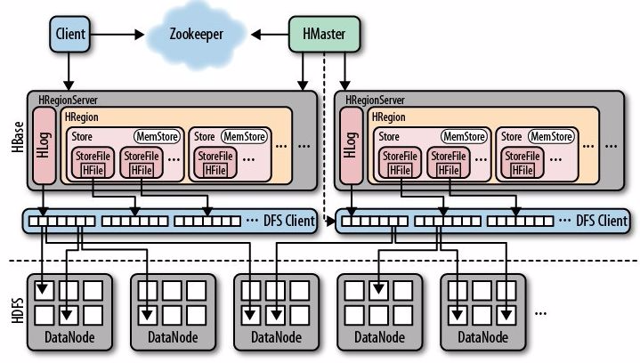

## 架构

HBase 借鉴了 BigTable 论文，是典型的 Master-Slave 模型。Master 节点负责管理集群，RegionServer 节点负责处理读写请求。HBase 的数据最终存储在 HDFS 上，并且使用 ZooKeeper 用于协助 Master 管理集群。


### 客户端

HBase 客户端提供了 Shell 命令行接口、原生 Java API 编程接口、Thrift/REST API 编程接口以及 MapReduce 编程接口。HBase 客户端支持所有常见的 DML 操作以及 DDL 操作，其中 Thrift/REST API 主要用于支持非 Java 的上层业务需求，MapReduce 接口主要用于批量数据导入以及批量数据读取。

HBase 客户端访问数据之前，需要先通过元数据表 (hbase:meta) 定位目标数据所在 RegionServer，之后才会发送请求到该 RegionServer，同时元数据表中的数据将会被缓存在客户端本地，以方便之后的请求访问。如果集群中 RegionServer 发生宕机或者执行了负载均衡导致数据分片发生迁移，则客户端需要重新请求最新的元数据并缓存在本地。

### ZooKeeper

ZooKeeper 是基于 Google 的 Chubby 开源实现，主要用于协调管理分布式应用程序。在 HBase 系统中，ZooKeeper 扮演着非常重要的角色：
- **实现 Master 高可用**：系统中一般有一个 active Master 和多个 standby Master，一旦 active Master 宕机，ZooKeeper 就会检测到宕机事件，然后通过选举机制从 standby Master 中选举出新的 Master 作为 active Master 完成切换，保证系统的可用性
- **管理系统核心元数据**：ZooKeeper 中保存着系统元数据表 hbase:meta 所在的 RegionServer 地址，同时 ZooKeeper 中也管理着当前系统中正常工作的 RegionServer 集合
- **参与 RegionServer 宕机恢复**：ZooKeeper 通过心跳可以感知到 RegionServer 是否宕机，并通知 Master 对宕机的 RegionServer 做分片迁移
- **实现分布式锁**：HBase 中对表进行各种管理操作需要先加表锁，ZooKeeper 可以通过其特定的机制实现分布式表锁

### Master

Master 主要负责 HBase 系统的各种管理工作：
- 处理用户的各种管理请求，如建表、修改表、切分表、合并数据分片等
- 管理集群中所有 RegionServer，包括 RegionServer 中 Region 的负载均衡、RegionServer 的宕机恢复以及 Region 的迁移等
- 清理过期日志以及文件，Master 会每隔一段时间检查 HDFS 中 HLog 是否过期、HFile 是否已经被删除，并在过期之后将其删除

### RegionServer

RegionServer 主要用来响应用户的 IO 请求，由 WAL(HLog)、BlockCache 以及多个 Region 构成。
- **WAL(HLog)**：HLog 在 HBase 中有两个核心作用：
  - 用于实现数据的高可靠性，HBase 数据随机写入时并非直接写入 HFile 数据文件，而是先写入缓存(MemStore)，然后再异步刷新落盘。为了防止缓存数据丢失，数据写入缓存之前需要首先顺序写入 HLog，这样即使缓存数据丢失，仍然可以通过 HLog 日志恢复
  - 用于实现 HBase 集群间主从复制，通过回放主集群推送过来的 HLog 日志实现主从复制
- **BlockCache**：BlockCache 是 HBase 系统中的读缓存，客户端从磁盘读取数据之后通常会将数据缓存到系统内存之中，后续访问同一行数据可以直接从内存中获取而不需要访问磁盘，对于带有大量热点读的业务请求来说，缓存机制会带来极大的性能提升
- **Region**：Region 是数据表的一个切片，当数据表大小超过一定阈值就会“水平切分”成为两个 Region。Region 是集群负载均衡的基本单位，通常一张表的 Region 会分布在整个集群的多台 RegionServer 上，一个RegionServer 上会管理多个 Region。

### HDFS

HBase 底层依赖 HDFS 组件存储数据，包括用户数据文件、HLog 日志文件等最终都会写入 HDFS。HBase 内部封装了一个名为 DFSClient 的客户端组件，负责对 HDFS 的实际数据进行读写访问。


## 部署

- ```backup-masters```：文本文件，记录 backup Master 的主机地址列表，每个主机地址一行
- ```hadoop-metrics2-hbase.properties```：用于配置连接 HBase Hadoop Metrics2 框架
- ```hbase-env.sh```：配置 HBase 的环境信息
- ```hbase-policy.xm```：配置 RCP 认证策略
- ```hbase-site.xml```：HBase 的主配置文件，配置之后会覆盖 HBase 的默认配置

### Docker

### K8S

## 配置

HBase 依赖于 ZooKeeper 和 HDFS，通过配置 ZooKeeper 和 HDFS 的参数可以使 HBase 达到更佳的性能。

### ZooKeeper

HBase 使用 ZooKeeper 实现了 Master 的高可用、RegionServer 宕机异常检测、分布式锁等一系列功能。HBase 集群的部署依赖于 ZooKeeper，在 HBase 的配置文件 conf/hbase-site.xml 中需要配置 ZooKeeper 相关的属性：
```xml
<!-- 配置 ZK 集群 host，必需 -->
<property>
    <name>hbase.zookeeper.quorum</name>
    <value>localhost</value>
</property>
<!-- ZK 客户端端口，非必需 -->
<property>
    <name>hbase.zookeeper.property.clientPort</name>
    <value>2181</value>
</property>
```
ZooKeeper 中存储了 HBase 的元数据信息，这些数据通过在 ZooKeeper 的 /hbase 节点下创建子节点保存：
- ```meta-region-server```： 存储 HBase 集群 hbase:meta 元数据表所在的 RegionServer 访问地址。客户端读写数据首先会从此节点读取 hbase:meta 元数据的访问地址，将部分元数据加载到本地，根据元数据进行数据路由
- ```master/backup-master```：存储 HBase 集群中 Master 和 backupMaster 节点的信息
- ```table```：集群中所有表的信息
- ```region-in-transition```：记录 Region 迁移过程中的状态变更。Region 的迁移需要先执行 unassign 操作将此 Region 从 open 状态变为 offline 状态(中间涉及 pending_close, closing, closed 等过渡状态)，然后在目标 RegionServer 上执行 assign 操作使 Region 的状态从 offline 变为 open，在 Region 的整个迁移过程中 RegionServer 将 Region 的状态保存到 ZooKeeper 的 ```/hbase/region-in-transition``` 节点中。Master 监听 ZooKeeper 对应的节点，当 Region 状态发生变更后能立马获得通知，然后更新 Region 在 hbase:meta 中的状态和内存中的状态
- ```table-lock```：HBase 使用 ZooKeeper 实现分布式锁。HBase 支持单行事务，对表的 DDL 操作之前需要先获取表锁，防止多个 DDL 操作之间发生冲突，由于 Region 分布在多个 RegionServer 上，因此表锁需要使用分布式锁
- ```onlline-snapshot```：实现在线 snapshot 操作。Master 通过 online-snapshot 节点通知监听的 RegionServer 对目标 Region 执行 snapshot 操作
- ```replication```：实现 HBase 复制功能
- ```splitWAL/recovering-regions```：用于 HBase 故障恢复
- ```rs```：存储集群中所有运行的 RegionServer
- ```hbaseid```：
- ```namespace```：
- ```balancer```：

### HDFS

HBase 的数据文件都存放在 HDFS 上，通过 HDFS 的可扩展性以及多副本可靠性保证 HBase 的可扩展性和高可靠性。

- HBase 本身并不存储文件，它只规定文件格式以及文件内容，实际文件存储由 HDFS 实现
- HBase 不提供机制保证存储数据的高可靠，数据的高可靠性由 HDFS 的多副本机制保证
- HBase-HDFS 体系是典型的计算存储分离架构，可以方便的使用其他存储代替 HDFS 作为 HBase 的存储方案，也可以使计算资源和存储资源独立扩容缩容

HBase 基于 HDFS 存储的体系是典型的计算和存储分离的架构，这种耦合使得可以独立的扩容存储或者计算而不会相互影响。

HBase 的数据默认存储在 HDFS 的 ```/hbase```目录下：
- ```.hbase-snapshot```：snapshot 文件存储目录，执行 snapshot 操作后相关的 snapshot 元数据文件存储在该目录
- ```.tmp```：临时文件目录，主要用于 HBase 表的创建和删除操作。表创建的时候首先会在 tmp 目录下执行，执行成功后再将 tmp 目录下的表信息移动到实际表目录下。表删除操作会将表目录移动到 tmp 目录下，一定时间过后再将 tmp 目录下的文件真正删除
- ```MasterProcWALs```：存储 Master Procedure 过程中的 WAL 文件。Master Procedure 功能主要主要用于可恢复的分布式 DDL 操作，Master Procedure 使用 WAL 记录 DDL 执行的中间状态，在异常发生之后可以通过 WAL 回放明确定位到中间状态点，继续执行后续操作以保证整个 DDL 操作的完整性
- ```WALs```：存储集群中所有 RegionServer 的 HLog 文件
- ```achive```：文件归档目录，主要在以下场景使用：
  - 所有对 HFile 文件的删除操作都会将待删除文件临时存放在该目录
  - 进行 Snapshot 或者升级时使用到的归档目录
  - Compaction 删除 HFile 的时候，会把就得 HFile 移动到该目录
- ```corrupt```：存储损坏的 HLog 文件或者 HFile 文件
- ```data```：存储集群中所有 Region 的 HFile 文件，HFile 文件位于该目录下对应的```<namespace>/<table>/<region>/<family>/<file>``` 中

除了 HFile 文件外，data 目录下还存储了一些重要的目录和子文件：
- ```.tabledesc```：表描述文件，记录对应表的基本 schema 信息
- ```.tmp```：表临时目录，主要用来存储 Flush 和 Comapction 过程中的中间结果
- ```.regioninfo```：Region 描述文件
- ```recovered.edits```：存储故障恢复时该 Region 需要回放的 WAL 日志。RegionServer 宕机之后，该节点上还没有来得及 flush 到磁盘的数据需要通过 WAL 回放恢复，WAL 文件首先需要按照 Region 进行切分，每个 Region 拥有对应的 WAL 数据片段，回放时只需要回放自己的 WAL 数据片段即可
- ```hbase.id```：集群启动初始化的时候，创建的集群唯一 id
- ```hbase.version```：HBase 软件版本，代码静态版本
- ```oldWALs```：WAL 归档目录。一旦一个 WAL 文件中记录的所有 K-V 数据确认已经从 MemStore 持久化到 HFile，那么该 WAL 文件就会被移除到该目录