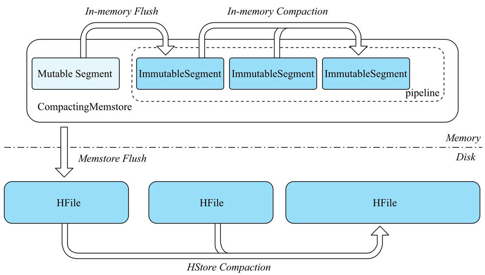

## MemStore

HBase 基于 LSM 树实现，所有写入的数据都会写入 MemStore 中，当触发 flush 时 MemStore 中的数据就会批量的写入磁盘生成 HFile 文件。

基于 LSM 树架构，HBase 将随机写转换为内存的随机写和磁盘的顺序写，使得写性能得到极大提升。

MemStore 使用跳跃表结构保证在有序的情况下保证查询、插入操作的时间复杂度为 O(logN)。为了防止 MemStore 在 flush 之后产生过多的内存碎片，HBase 借鉴 TLAB (Thread-Local Allocation Buffer) 机制引入了 `MemStoreLAB` 来保存写入的数据。

- 数据写入 MemStore 时会将写入的 KeyValue 复制到 Chunk 中并返回新的 Cell 对象引用 Chunk 中的 KeyValue
- 返回的 Cell 对象会写入跳跃表结构中保证写入数据的顺序，新生成的 Cell 对象较写入的 KeyValue 对象小得多

`MemStoreLAB` 将零碎的内存变成紧凑的内存块，为了防止 MemStoreLAB 中的 Chunk 回收，HBase 在每个 RegionServer 上引入全局 `MemStoreChunkPool` 来全局的管理 Chunk 的生成和回收：

- `MemStoreLAB` 对象的 Chunk 写满后需要向 `MemStoreChunkPool` 申请新的 Chunk
- `MemStoreChunkPool` 在处理 Chunk 申请时首先确定是否有空闲的 Chunk，有则直接返回空闲的 Chunk，否则创建新的 Chunk 返回
- `Chunk` 没有被使用时并不会被 JVM 回收，而是由 `MemStoreChunkPool` 管理

### CompactingMemStore

`ConcurrentSkipList` 结构并不是内存友好的，其每个节点除了数据对象外，还包含过多的索引对象占用了额外内存。

HBase 引入了 In-Memory 机制来减少额外的内存占用，其核心原理是将 MemStore 分成可变的 `MutalbeSegment` 和不可变的 `ImmutableSegment`，并且将不可变的 `ImmutableSegment` 中的 `ConcurrentSkipList` 结构转换成内存友好的 `CellArrayInmuutableSegment` 或者 `CellImmutableSegment`。



In-Memory Compaction 机制是通过 `CompactingMemStore` 完成，`CompactingMemStore` 将 MemStore 划分为一个 MutableSegment 和多个 ImmutableSegment，Column Family的写入操作时，先写入 MutableSegment，一旦发现 MutableSegment 占用的空间超过 2 MB，则把当前 MutableSegment 切换成 ImmutableSegment，然后初始化一个新的 MutableSegment 供后续的写入。


```
// todo
```


HBase 中 MSLAB 功能默认是开启的，可以通过参数 ```hbase.hregion.memstore.mslab.chunksize``` 设置 ChunkSize 的大小，默认是 2M，建议保持默认值；Chunk Pool 功能默认是关闭的，通过参数 ```hbase.hregion.memstore.chunkpool.maxsize``` 为大于 0 的值才能开启，默认是 0，该值得取值范围为 [0,1] 表示整个 MemStore 分配给 Chunk Pool 的总大小；参数 ```hbase.hregion.memstore.chunkpool.initialsize``` 取值为 [0,1] 表示初始化时申请多少个 Chunk 放到 Chunk Pool 里面，默认是 0


HBase 2.x 版本引入了 Segment 的概念，本质上是一个维护一个有序的 cell 列表，根据 cell 列表是否可更改，Segment 可以分为两种类型：

- MutableSegment：支持添加 cell、删除 cell、扫描 cell、读取某个 cell 等操作，一般使用 ConcurrentSkipListMap 来维护
- ImmutableSegment：只支持扫描 cell 和读取某个 cell 这种查找类操作，不支持添加、删除等写入操作，只需要一个数据维护即可

HBase 还引入了 CompactingMemStore，将原来的 128M 大小的 MemStore 划分成很多个小的 Segment，其中一个 MutableSegment 和多个 ImmutableSegment。

CompactingMemStore 中的所有 ImmutableSegment 称为 pipeline，本质上是按照 ImmutableSegment 加入的顺序组成的一个 FIFO 队列。当 Column Family 发起读取或者扫描操作时，需要将这个 CompactingMemStore 的一个 MutableSegment、多个 ImmutableSegment 以及磁盘上的多个 HFile 组织成多个内部数据有序的 Scanner，然后将这些 Scanner 通过多路归并算法合并生成可以读取 Column Family 数据的 Scanner。

随着数据的不断写入，ImmutableSegment 个数不断增加，需要多路归并的 Scanner 就会很多，降低读取操作的性能。所以当 ImmutableSegment 个数达到某个阈值(hbase.hregion.compacting.pipeline.segments.limit 设置，默认值 2)时，CompactingMemStore 会触发一次 InMemtory 的 MemStoreCompaction，也就是将 CompactingMemStore 的所有 ImmutableSegment 多路归并成一个 ImmutableSegment，这样 CompactingMemStore 产生的 Scanner 数量就会得到很好地控制，对杜兴能基本无影响。

ImmutableSegment 的 Compaction 同样会清理掉无效的数据，包括 TTL 过期数据、超过指定版本的数据、以及标记为删除的数据，从而节省了内存空间，使得 MemStore 占用的内存增长变缓，减少 MemStore Flush 的频率。

CompactingMemStore 中引入 ImmutableSegment 之后使得更多的性能优化和内存优化得到可能。ImutableSegment 需要维护的有序列表不可变，因此可以直接使用数组而不再需要使用跳跃表(ConcurrentSkipListMap)，从而节省了大量的节点开销，也避免了内存碎片。

相比 DefaultMemStore，CompactingMemStore 触发 Flush 的频率会小很多，单次 Flush 操作生成的 HFile 数据量会变大，因此 HFile 数量的增长就会变慢，这样至少有三个好处：

- 磁盘上 Compaction 的触发频率降低，HFile 数量少了，无论是 Minor Compaction 还是 Major Compaction 次数都会降低，这会节省很大一部分磁盘带宽和网络带宽
- 生成的 HFile 数量变少，读取性能得到提升
- 新写入的数据在内存中保留的时间更长，对于写完立即读的场景性能会有很大提升

使用数组代替跳跃表后，每个 ImmutableSegment 仍然需要在内存中维护一个 cell 列表，其中每一个 cell 指向 MemStoreLAB 中的某一个 Chunk。可以把这个 cell 列表顺序编码在很少的几个 Chunk 中，这样 ImmutableSegment 的内存占用可以进一步减少，同时实现了零散对象“凑零为整”，进一步减少了内存的占用。

可以在配置文件 hbase-site.xml 中配置集群中所有表都开启 In Memory Compaction 功能：

```xml
hbae.hregion.compacting.memstore.type=BASIC
```

也可以在创建表的时候指定开启 In Memory Compaction 功能：

```shell
create 'test', {NAME=>'cf', IN_MEMORY_COMPACTION=>'BASIC'}
```

In Memory Compaction 有三种配置值：

- NONE：默认值，表示不开启 In Memory Compaction 功能，而使用 DefaultMemStore
- BASIC：开启 In Memory Compaction 功能，但是在 ImmutableSegment 上 Compaction 的时候不会使用 ScanQueryMatcher 过滤无效数据，同时 cell 指向的内存数据不会发生任何移动
- EAGER：开启 In Memory Compaction 功能，在 ImmutableSegment Compaction 的时候会通过 ScanQueryMatcher 过滤无效数据，并重新整理 cell 指向的内存数据，将其拷贝到一个全新的内存区域

如果表中存在大流量特定行的数据更新，则使用 EAGER，否则使用 BASIC。

### Flush

`MemStore` 刷盘的最小单元是 Region，也就是说在触发刷盘时当前 Region  的所有 `MemStore` 都需要将数据刷盘到 HDFS。只要满足下列任意情况都会触发 `MemStore` 刷盘：

- `MemStore` 大小超过 `hbase.hregion.memstore` 配置的值，则当前 Region 的所有 MemStore 都会刷盘
- RegionServer 中所有的 MemStore 大小之和超过 `hbase.regionserver.global.memstore.upperLimit` 配置的值，则所有的 Region 按照 MemStore 的使用量降序刷盘，直到所有的 MemStore 之和降至 `hbase.regionserver.global.memstore.lowerLimit`
- 当 RegionServer 的 WAL 的条目达到了 `hbase.regionserver.max.logs`，则所有 Region 的 MemStore 按照时间刷盘，直到 WAL 的数量降至 `hbase.regionserver.max.logs`

HBase 采用了类似于二阶段提交的方式将整个 flush 过程分为了三个阶段：

- prepare 阶段：遍历当前 Region 中所有 MemStore，将 MemStore 中当前数据集 CellSkipListSet(采用 ConcurrentSkipListMap) 做一个快照 snapshot，然后再新建一个 CellSkipListMap 接收新的数据写入。prepare 阶段需要添加 updateLock 对写请求阻塞，结束之后会释放该锁，持锁时间很短
- flush 阶段：遍历所有 MemStore，将 prepare 阶段生成的 snapshot 持久化为临时文件，放入目录 .tmp 下，这个过程涉及到磁盘 IO，因此比较耗时
- commit 阶段：遍历所有的 MemStore，将 flush 阶段生成的临时文件移到指定的 ColumFamily 目录下，针对 HFile 生成对应的 storefile 和 Reader，把 storefile 添加到 Store 的 storefile 列表中，最后再清空 prepare 阶段生成的 snapshot

通过 shell 命令 flush 'tablename' 或者 flush 'regionname' 分别对一个表或者一个 Region 进行 flush

```

```

https://blog.csdn.net/u011598442/article/details/105571034