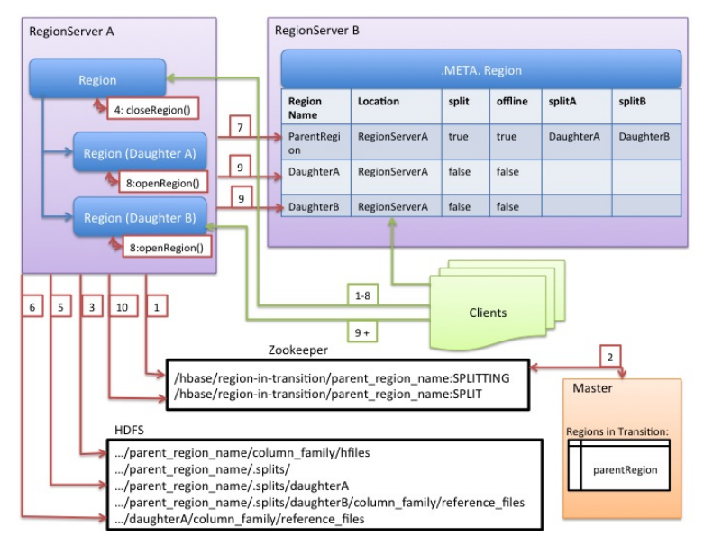

### Region

Region 是 Table 的可用性和分布式的最基本元素，Region 由和表列簇相等个数的 Store 组成，写入的数据最终会形成多个 HFile 文件存储在 HDFS。

默认情况下，建表时只有一个 Region，随着数据的写入 Region 在达到阈值以后会触发分裂。

集群在负载不均衡或者 RegionServer 故障时需要将 Region 重新迁移到合适的节点。

### Region 分裂

Region 分裂是实现分布式可扩展的基础，HBase 定义多种分裂策略，当 Region 满足设置的分裂策略时就会触发分裂操作。

#### 分裂策略

Region 分裂策略决定 Region 是否需要分裂，HBase 定义了多种分裂策略，不同的分裂策略适用于不同的应用场景：

- `ConstantSizeRegionSplitPolicy`：Region 中最大 Store 超过设置阈值`hbase.hregion.max.filesize` 就会触发分裂。这种策略实现简单，但是对于大表和小表没有明显的区分，阈值设置较大则对大表比较友好，而小表可能不会分裂，极端情况下只有一个 Region，这对 RegionServer 压力比较大；如果阈值设置的比较小，则大表会在集群中产生大量的 Region，从而会导致大量的 HFile，这对集群的管理来说增加了负担
- `IncreasingToUpperBoundRegionSplitPolicy`：这种策略也是在一个 Region 中最大的 Store 大小超过阈值之后触发分裂，但是这种策略的阈值并不是固定的，而是和 Region 所属表在的 RegionServer 上的 Region 数量有关，其值为 ```regions * regions * regions * flushsize * 2```，这个值得上限为 MaxRegionFileSize，这种策略会使得很多小表就会产生大量小的 Region
- `SteppingSplitPolicy`：这种策略的分裂阈值大小和待分裂 Region 所属表当前 RegionServer 上的 Region 个数有关，如果 Region 个数为 1，分裂阈值为 flushsize * 2，否则为 MaxRegionFileSize，这种策略不会使得小表再产生大量的小 Region

在创建表时指定不同的分裂策略

```java
TableDescriptorBuilder.setRegionSplitPolicyClassName(class_name);
```

#### 分裂点

Region 触发分裂之后首先需要找到分裂点，Region 的分裂点定义为：**Region 中最大 Store 中的最大文件中最中心的 Block 的首个 rowkey**，如果 rowkey 是整个文件的首个 rowkey 或最后一个 rowkey 时则没有分裂点，此时整个 Region 中只有一个 block。

```
# 手动执行 split

```


#### 分裂流程

HBase 将分裂流程包装成事务，从而保证分裂过程的原子性。分裂流程分为三个阶段：prepare， exuecte 和 rollback。

##### Prepare

prepare 阶段在内存中初始化两个子 Region，每个 Region 对应一个 HRegionInfo 对象，同时会生成一个 transaction journal 对象用来记录分裂的进程

##### execute

execute 阶段是整个分裂过程的核心阶段，总共分为 8 个步骤：




- RegionServer 将 ZK 节点 /region-in-transaction 中该结点的状态更改为 SPLITING
- Master 通过 watch 节点 /region-in-transaction 检测到 Region 状态改变，并修改内存中 Region 的状态，在 Master 页面 RIT 模块可以看到 Region 执行 split 的状态信息
- 在父存储目录下新建临时文件夹 .split，保存 split 后的 daughter region 信息
- 关闭父 Region，父 Region 关闭数据写入并触发 flush 操作，将写入 Region 的数据全部持久化到磁盘，此后短时间内客户端落在父 Region 上的请求都会抛出 NotServingRegionException
- 在 .split 文件夹下新建两个子文件夹，称为 daughter A，daughter B，并在文件夹中生成 reference 文件，分别指向父 Region 中对应文件。reference 文件是一个引用文件，文件内容并不是用户数据，而是由两部分组成：分裂点 splitkey 和 boolean 类型的变量表示该 reference 文件引用的是父文件的上半部分(true)或者下半部分(false)，使用 hadoop 命令 ```hadoop dfs -cat /hbase-rsgroup/data/default/...``` 可以查看 reference 文件内容
- 父 Region 分裂为两个子 Region 后，将 daughter A、daughter B 拷贝到 HBase 根目录下，形成两个新的 Region
- 父 Region 通知修改 hbase:meta 表后下线，不再提供服务。下线后父 Region 在 meta 表中的信息并不会马上删除，而是将 meta 表中的 split 列、offline 列标注为 true，并记录两个子 Region
- 开启 daughter A、daughter B 两个子 Region。通知修改 hbase:meta 表正式对外提供服务

##### rollback

如果 execute 阶段出现异常，则执行 rollback 操作。为了实现回滚，整个分裂过程分为很多子阶段，回滚程序会根据当前进展到哪个子阶段清理对应的垃圾数据，整个分裂的过程的阶段由 RegionMergeTransactionPhase 类定义

Region 分裂是一个比较复杂的过程，涉及到父 Region 中 HFile 文件分裂，子 Region 生成，meta 元数据更新等很多个子步骤，为了实现原子性，HBase 使用状态机的方式保存分裂过程中的每个子步骤状态，这样一旦出现异常，系统可以根据当前所处的状态决定是否回滚，以及如何回滚。目前这些中间状态都只存储在内存中，一旦在分裂过程中出现 RegionServer 宕机的情况则有可能出现分裂处于中间状态的情况，即 RIT 状态，这种情况下需要使用 HBCK 工具查看并分析解决方案。

在 2.0 版本之后，HBase 实现了新的分布式事务框架 Procedure V2，新框架使用类似 HLog 的日志文件存储这种单机事务的中间状态，因此可以保证即使在事务执行过程中参与者发生了宕机，依然可以使用对应日志文件作为协调者，对事务进行回滚操作或者重试提交，从而大大减少甚至杜绝 RIT 现象。

通过 reference 文件查找数据分为两步：

- 根据 reference 文件名(父 Region 名 + HFile 文件名)定位到真实数据所在文件路径
- 根据 reference 文件内容记录的两个重要字段确定实际扫描范围，top 字段表示扫描范围是 HFile 上半部分还是下半部分，如果 top 为 true 则表示扫描的范围为 [firstkey, splitkey)，如果 top 为 false 则表示扫描的范围为 [splitkey, endkey)

父 Region 的数据迁移到子 Region 目录的时间发生在子 Region 执行 Major Compaction 时，在子 Region 执行 Major Compaction 时会将父 Region 目录中属于该子 Region 中所有的数据读取出来，并写入子 Region 目录数据文件中。

Master 会启动一个线程定期遍历检查所处于 splitting 状态的 Region，确定父 Region 是否可以被清理，检查过程分为两步：

- 检测线程首先会在 meta 表中读出所有 spit 列为 true 的 Region，并加载出其分裂后生成的两个子 Region(meta 表中 splitA 和 splitB 两列)
- 检查两个子 Region 是否还存在引用文件，如果都不存在引用文件就可以认为该父 Region 对应的文件可以被删除

HBCK 可以查看并修复在 split 过程中发生异常导致 region-in-transaction 问题，主要命令包括：

```shell
-fixSplitParents
-removeParents
-fixReferenceFiles
```


### Region 迁移

HBase 的集群负载均衡、故障恢复功能都是建立在 Region 迁移的基础之上，HBase 由于数据实际存储在 HDFS 上，在迁移过程中不需要迁移实际数据而只需要迁移读写服务即可，因此 HBase 的 Region 迁移是非常轻量级的。

Region 迁移虽然是一个轻量级操作，但是实现逻辑依然比较复杂，其复杂性在于两个方面：

- Region 迁移过程中设计多种状态的改变
- Region 迁移过程中设计 Master，ZK 和 RegionServer 等多个组件的互相协调

Region 迁移的过程分为 unassign 和 assign 两个阶段

#### unassign

unassign 阶段是 Region 从 RegionServer 下线，总共涉及 4 个状态变化

- Master 生成事件 M_ZK_REGION_CLOSING 并更新到 ZK 组件，同时将本地内存中该 Region 的状态修改为 PENDING_CLOSE
- Master 通过 RPC 发送 close 命令给拥有该 Region 的 RegionServer，令其关闭该 Region
- RegionServer 接收到 Master 发送过来的命令后，生成一个 RS_ZK_REGION_CLOSING 事件，更新到 ZK
- Master 监听到 ZK 节点变动后，更新内存中 Region 的状态为 CLOSING
- RegionServer 执行 Region 关闭操作。如果该 Region 正在执行 flush 或者 Compaction，则等待其完成；否则将该 Region 下的所有 MemStore 强制 flush，然后关闭 Region 相关服务
- RegionServer 执行完 Region 关闭操作后生成事件 RS_ZK_REGION_CLOSED 更新到 ZK，Master 监听到 ZK 节点变化后，更新该 Region 的状态为 CLOSED

#### assign

assign 阶段是 Region 从目标 RegionServer 上线，也会涉及到 4 个状态变化

- Master 生成事件 M_ZK_REGION_OFFLINE 并更新到 ZK 组件，同时将本地内存中该 Region 的状态修改为 PENDING_OPEN
- Master 通过 RPC 发送 open 命令给拥有该 Region 的 RegionServer，令其打开 Region
- RegionServer 接收到命令之后，生成一个 RS_ZK_REGION_OPENING 事件，并更新到 ZK
- Master 监听到 ZK 节点变化后，更新内存中 Region 的状态为 OPENING
- RegionServer 执行 Region 打开操作，初始化相应的服务
- 打开完成之后生成事件 RS_ZK_REGION_OPENED 并更新到 ZK，Master 监听到 ZK 节点变化后，更新该 Region 状态为 OPEN

整个 unassign 和 assign 过程涉及 Master、RegionServer 和 ZK 三个组件，三个组件的职责如下：

- Master 负责维护 Region 在整个过程中的状态变化
- RegionServer 负责接收 Master 的指令执行具体 unassign 和 assign 操作，即关闭 Region 和打开 Region 的操作
- ZK 负责存储操作过程中的事件，ZK 有一个路径为 /hbase/region-in-transaction 节点，一旦 Region 发生 unassign 操作，就会在这个节点下生成一个子节点，Master 会监听此节点，一旦发生任何事件，Master 会监听到并更新 Region 的状态

Region 在迁移的过程中涉及到多个状态的变化，这些状态可以记录 unassign 和 assign 的进度，在发生异常时可以根据具体进度继续执行。Region 的状态会存储在三个区域：

- meta 表，只存储 Region 所在的 RegionServer，并不存储迁移过程中的中间状态，如果 Region 迁移完成则会更新为新的对应关系，如果迁移过程失败则保存的是之前的映射关系
- master 内存，存储整个集群所有的 Region 信息，根据这个信息可以得出此 Region 当前以什么状态在哪个 RegionServer 上。Master 存储的 Region 状态变更都是由 RegionServer 通过 ZK 通知给 Master 的，所以 Master 上的 Region 状态变更总是滞后于真正的 Region 状态变更，而 WebUI 上看到的 Region 状态都是来自于 Master 的内存信息
- ZK，存储的是临时性的状态转移信息，作为 Master 和 RegionServer 之间反馈 Region 状态的通信，Master 可以根据 ZK 上存储的状态作为依据据需进行迁移操作

### Region 合并

Regin 合并用于空闲 Region 很多从而导致集群管理运维成本增加的场景，通过使用在线合并功能将这些 Region 与相邻的 Region 合并，减少集群中空闲的 Region 个数。

Region 合并的主要流程如下：

- 客户端发送 merge 请求给 Master
- Master 将待合并的所有 Region 都 move 到同一个 RegionServer 上
- Master 发送 merge 请求给该 RegionServer
- RegionServer 启动一个本地事务执行 merge 操作
- merge 操作将待合并的两个 Region 下线，并将两个 Region 的文件进行合并
- 将这两个 Region 从 hbase:meta 中删除，并将新生成的 Region 添加到 hbase:meta 中
- 将新生成的 Region 上线

HBase 使用 merge_region 命令执行 Region 合并，merge_region 操作是异步的，需要在执行一段时间之后手动检测合并是否成功，默认情况下 merge_region 只能合并相邻的两个 Region，如果可选参数设置为 true 则可以强制合并非相邻的 Region，风险较大不建议生产使用：

```shell
merge_region 'regionA', 'regionB', true
```


### 调优

通常 Habse 每个服务器上运行这比较少的 Region（20-200），但每个 Region 保存比较大的数据(5-20Gb)
