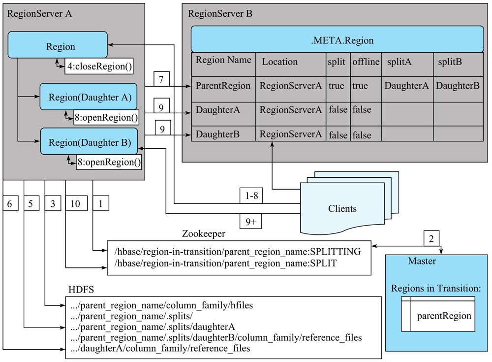

### Region

Region 是 Table 的可用性和分布式的最基本元素，Region 由和表列簇相等个数的 Store 组成，写入的数据最终会形成多个 HFile 文件存储在 HDFS。

HFile 文件数量过多会严重影响 HBase 的读性能，RegionServer 在后台运行着检测线程，当满足条件时就会触发 Region Compaction 操作。

Region 随着数据的写入会越来越大不利于集群的负载均衡，当 Region 的大小达到 Region 分裂策略的阈值时就会触发 Region 分裂。

集群在负载不均衡或者 RegionServer 故障时需要将 Region 重新迁移到合适的节点。

### Region Compaction

`Region Compaction` 是从 Region 中的某个 Store 中选择部分 HFile 文件依次读取出存储的 KeyValue，然后排序之后写入一个新的 HFile 文件。

HBase 根据参与合并文件的规模将 Compaction 操作分为两类：

- `Minor Compaction`：选取 Store 的部分 HFile 合并成一个更大的 HFile
- `Major Compaction`：Store 中的所有 HFile 合并成一个 HFile，合并过程中会完全清理掉被删除的数据、过期数据、超过版本设置的数据

Region 在 Compaction 的过程中会影响业务性能，而 Major Compaction 过程中所有的 HFile 都会参与合并，因此一般会关闭自动触发 Major Comapction，而是在业务低峰期手动触发。

HBase 通过 Compaction 操作提升了系统的读性能：

- Region 经过 Compaction 之后文件的数量减少，因而在读数据时的 IO 操作减少
- HFile 在合并的过程中会将其他 DataNode 的数据读取到当前 RegionServer 然后再合并，从而提高了数据的本地化率，减少读数据时的网络开销
- Major Compaction 会删除冗余的数据，减少了读数据时扫描的数据量

Compaction 过程需要读写数据，因此也会有明显的副作用：

- 执行文件合并之前需要读取数据，增加 IO 和网络开销，导致读数据时有明显的 “毛刺” 现象
- 文件合并之后需要再次写入磁盘，导致写放大

#### Compaction 时机

HBase 中 Compaction 操作通常会在三种情况下触发：

- MemStore flush 之后检查当前 Store 中的文件数，如果超过 `hbase.hstore.compactionThreshold` 的值就会触发 Compaction
- HRegionServer 在后台运行 `compactionChecker` 线程周期性的检查 Store 是否需要执行 Compaction
- 通过手动的方式触发 Major Compaction 执行

Region Compaction 触发后 HBase 就会开始执行 Compaction 流程，HRegionServer 在后台运行着 `compactSplit` 线程处理 Compaction，该线程首先会从对应 Store 中根据文件选取算法选择合适的 HFile 文件进行合并，然后将这些文件在特定的线程池中执行文件合并的具体操作。

#### Compaction 策略

`Region Compaction` 首先会排除 Store 中不满足条件的 HFile 文件：

- 当前正在执行 Compaction 的 HFile 文件
- 文件大小超过 `hbase.hstore.compaction.max.size` 的文件

剩余的文件需要继续判断是否需要触发 Major Compaction，如果满足任意一个条件则这些文件需要全部参与 Compaction：

- 上次执行 Major Compaction 的时间早于 `hbase.hregion.majorcompaction` 并且文件数量小于 `hbase.hstore.compaction.max`
- 文件中含有 reference 文件(Region 分裂产生的临时文件)

如果不满足则会在候选文件上利用合并策略选择合适的文件进行合并，HBase 提供了多种文件和并策略：

- `RatioBasedCompactionPolicy`：选择
- `ExploringCompactionPolicy`
- `FIFOCompactionPolicy`
- `StripeCompactionPolicy`
- `DateTieredCompactionPolicy`

创建表的时候可以指定列簇的 Compaction 策略：

```java
ColumnFamilyDescriptorBuilder
    .setConfiguration(DefaultStoreEngine.DEFAULT_COMPACTOR_CLASS_KEY, FIFOCompactionPolicy.class.getName());
TableDescriptorBuilder.setCompactionEnabled(true)
    .setColumnFamily(columnFamily);
```

Compaction 合并小文件，一方面提高了数据的本地化率，降低了数据读取的响应延时，另一方面也会因为大量消耗系统资源带来不同程度的短时间读取响应毛刺。HBase 提供了 Compaction 接口，可以根据自己的应用场景以及数据集订制特定的 Compaction 策略，优化 Compaction 主要从几个方面进行：

- 减少参与 Compaction 的文件数，需要将文件根据 rowkey、version 或其他属性进行分割，再根据这些属性挑选部分重要的文件参与合并，并且尽量不要合并那些大文件
- 不要合并那些不需要合并的文件，比如基本不会被查询的老数据，不进行合并也不会影响查询性能
- 小 Region 更有利于 Compaction，大 Region 会生成大量文件，不利于 Compaction

##### FIFO Compaction

FIFO Compaction 策略参考了 RocksDB 的实现，它选择过期的数据文件，即该文件内的所有数据均已经过期，然后将收集到的文件删除，因此适用于此 Compaction 策略的对应列簇必须设置 TTL。

FIFO Compaction 策略适用于大量短时间存储的原始数据的场景，比如推荐业务、最近日志查询等。FIFO Compaction 可以在表或者列簇上设置：

```java

```

##### Tier-Based Compaction

在现实业务中，有很大比例的业务数据都存在明显的热点数据，最近写入的数据被访问的频率比较高，针对这种情况，HBase 提供了 Tire-Based Compaction。这种方案根据候选文件的新老程度将其分为不同的等级，每个等级都有对应的参数，比如 Compaction Ratio 表示该等级的文件的选择几率。通过引入时间等级和 Compaction Ratio 等概念，就可以更加灵活的调整 Compaction 效率。

Tire-Based Compaction 方案基于时间窗的概念，当时间窗内的文件数达到 threshold (可通过参数 min_threshold 配置)时触发 Compaction 操作，时间窗内的文件将会被合并为一个大文件。基于时间窗的 Compaction 可以通过调整窗口大小来调整优先级，但是没有一个窗口时间包括所有文件，因此这个方案没有 Major Compaction 的功能，只能借助于 TTL 来清理过期文件。

Tire-Based Compaction 策略适合下面的场景：

- 时间序列数据，默认使用 TTL 删除，同时不会执行 delete 操作（特别适合）
- 时间序列数据，有全局更新操作以及少部分删除操作（比较适合）

##### Level Compaction

Level Compaction 设计思路是将 Store 中的所有数据划分为很多层，每一层有一部分数据。

数据不再按照时间先后进行组织，而是按照 KeyRange 进行组织，每个 KeyRange 进行包含多个文件，这些文件所有数据的 Key 必须分布在同一个范围。

整个数据体系会被划分为很多层，最上层(Level 0)表示最新的数据，最下层(Level 6)表示最旧数据，每一层都由大量 KeyRange 块组成，KeyRnage 之间没有重合。层数越大，对应层的每个 KeyRange 块越大，下层 KeyRange 块大小是上一层的 10 倍，数据从 MemStore 中 flush 之后，会先落入 Level 0，此时落入 Level 0 的数据可能包含所有可能的 Key，此时如果需要执行 Compaction，只需要将 Level 0 中的 KV 逐个读取出来，然后按照 Key 的分布分别插入 Level 1 中对应的 KeyRange 块的文件中，如果此时刚好 Level 1 中的某个 KeyRnage 块大小超过了阈值，就会继续往下一层合并

Level Compaction 中依然存在 Major Compaction 的概念，发生 Major Compaction 只需要将部分 Range 块内的文件执行合并就可以，而不需要合并整个 Region 内的数据文件。

这种合并策略实现中，从上到下只需要部分文件参与，而不需要对所有文件执行 Compaction 操作。另外，对于很多“只读最近写入的数据”的业务来说，大部分读请求都会落到 Level 0，这样可以使用 SSD 作为上层 Level 存储介质，进一步优化读。但是 Level Compaction 因为层数太多导致合并的次数明显增多，对 IO 利用率并没有显著提升。

##### Stripe Compaction

Stripe Compaction 和 Level Compaction 原理相同，会将整个 Store 中的文件按照 key 划分为多个 Range，称为 stripe。stripe 的数量可以通过参数设定，相邻的 stripe 之间 key 不会重合。实际上从概念上看，stripe 类似于将一个大的 Region 划分成的小 Region。

随着数据写入，MemStore 执行 flush 形成 HFile，这些 HFile 并不会马上写入对应的 stripe，而是放到一个称为 L0 的地方，用户可以配置 L0 放置 HFile 的数量。一旦 L0 放置的文件数超过设定值，系统会将这些 HFile 写入对应的 stripe：首先读出 HFile 的 KV，再根据 key 定位到具体的 stripe，将 KV 插入对应的 stripe 文件中。stripe 就是一个小的 Region，因此在 stripe 内部依然会有 Minor Compaction 和 Major Compaction，stripe 由于数据量并不是很大，因此 Major Compaction 并不会消耗太多资源。另外，数据读取可以根据对应的 key 查找到对应的 stripe，然后在 stripe 内部执行查找，因为 stripe 的数据量相对较小，所以也会在一定程度上提升数据查找性能。

Stripe Compaction 有两种比较擅长的业务场景：

- 大 Region。小 Region 没有必要切分为 stripe，一旦切分反而会带来额外的管理开销，一般默认 Region 小于 2G，就不适合使用 Stripe Compaction
- Rowkey 具有统一格式，Stripe Compaction 要求所有数据按照 key 进行切分，生成多个 stripe，如果 rowkey 不具有统一格式，则无法切分


MemStore 的 flush 操作会逐步增加磁盘上的文件数目，合并(compaction)进程会将它们合并成规模更少但是更大的文件。合并有两种类型：Minor 合并和 Major 合并。

Minor 合并负责将一些小文件合并成更大的文件，合并的最小文件数由 ```hbase.hstore.compaction.min``` 属性设置，默认值为 3，同时该值必须大于等于 2。如果设置的更大一些则可以延迟 Minor 合并的发生，但同时在合并时需要更多的资源和更长的时间。Minor 合并的最大文件数由 ```hbase.store.compaction.max``` 参数设置，默认为 10。
可以通过设置 ```hbase.hstore.cmpaction.min.size``` 和 ```hbase.hstore.compaction.max.size``` 设置参与合并的文件的大小，在达到单次 compaction 允许的最大文件数之前小于最小阈值的文件也会参与 compaction 但是大于最大阈值的文件不会参与。

Major 合并将所有的文件合成一个，这个过程是通过执行合并检查自动确定的。当 MemStore 被 flush 到磁盘、执行 compaction 或者 major_compaction 命令、调用合并相关 API都会触发检查。

#### HFile 文件合并

选择出需要执行 Compaction 文件之后,`CompactSplit` 根据文件的大小选择合适的线程池来执行文件合并操作，`CompactSplit` 内部构造了多种线程池，不同的线程池处理不同大小的文件：

- `longCompactions`：处理总文件大小超过 `hbase.regionserver.thread.compaction.throttle` 的 Compaction 操作
- `shortCompactions`：处理文件大小不超过阈值的 Compaction 操作

确定执行 Compaction 操作的线程池之后就会在选定的线程池内执行合并操作，合并流程分为 4 步：

- 读出待合并 HFile 文件的 KeyValue，归并排序处理后写到 ./tmp 目录下的临时文件中
- 待合并的 HFile 处理万之后将临时文件移动到对应 Store 的数据目录
- 将 Compaction 的输入文件路径和输出文件路径封装成 KV 写入 HLog 日志，并打上 Compaction 标记，最后强制执行 sync
- 将对应 Store 数据目录下的 Compaction 输入文件全部删除


HFile 合并流程具有很强的容错性和幂等性：

- 如果在移动临时文件到数据目录前 RegionServer 发生异常，则后续同样的 Compaction 并不会收到影响，只是 ./tmp 目录下会多一份临时文件
- 如果在写入 HLog 日志之前 RegionServer 发生异常，则只是 Store 对应的数据目录下多了一份数据，而不会影响真正的数据
- 如果在删除 Store 数据目录下的 Compaction 输入文件之前 RegionServer 异常，则 RegionServer 在重新打开 Region 之后首先会从 HLog 中看到标有 Compaction 的日志，只需要根据 HLog 移除 Compaction 输入文件即可

对文件进行 Compaction 操作可以提升业务读取性能，但是如果不对 Compaction 执行阶段的读写吞吐量进行限制，可能会引起短时间大量系统资源消耗，从而发生读写延迟抖动。可采用如下优化方案：

Limit Compaction Speed 优化方案通过感知 Compaction 的压力情况自动调节系统的 Compaction 吞吐量：

- 在正常情况下，设置吞吐量下限参数 hbase.hstore.compaction.throughput.lower.bound 和上限参数 hbase.hstore.compaction.throughput.higher.bound，实际吞吐量为 lower+(higher-lower)*ratio
- 如果当前 Store 中 HFile 的数量太多，并且超过了参数 blockingFileCount，此时所有写请求就会被阻塞以等待 Compaction 完成

Compaction 除了带来严重的 IO 消耗外，还会因为大量消耗带宽资源而严重影响业务：

- 正常请求下，Compaction 尤其是 Major Compaction 会将大量数据文件合并为一个大 HFile，读出所有数据文件的 KV，重新排序后写入另一个新建的文件，如果文件不在本地则需要跨网络进行数据读取，需要消耗网络带宽
- 数据写入文件默认都是三副本写入，不同副本位于不同节点，因此写的时候会跨网络执行，必然会消耗网络带宽

Compaction BandWidth Limit 优化方案主要设计两个参数：

- compactBwLimit：一次 Compaction 的最大带宽使用量，如果 Compaction 所使用的带宽高于该值，就会强制其 sleep 一段时间
- numOfFileDisableCompactLimit：在写请求非常大的情况下，限制 Compaction 带宽必然会导致 HFile 堆积，进而会影响读请求响应延迟，因此一旦 Store 中 HFile 数据超过设定值，带宽限制就会失效

### Region 分裂

Compaction 之后 Region 内的小文件会合并成大文件，满足分裂策略的条件后就会触发 Region 分裂。

#### 分裂策略

HBase 定义不同的分裂策略，不同的分裂策略有不同的应用场景

- `ConstantSizeRegionSplitPolicy`：表示一个 Region 中最大 Store 的大小超过设置阈值(hbase.hregion.max.filesize)之后触发分裂。这种策略实现简单，但是对于大表和小表没有明显的区分，阈值设置较大则对大表比较友好，而小表可能不会分裂，极端情况下只有一个 Region，这对 RegionServer 压力比较大；如果阈值设置的比较小，则大表会在集群中产生大量的 Region，这对集群的管理来说增加了负担
- `IncreasingToUpperBoundRegionSplitPolicy`：这种策略也是在一个 Region 中最大的 Store 大小超过阈值之后触发分裂，但是这种策略的阈值并不是固定的，而是和 Region 所属表在的 RegionServer 上的 Region 数量有关，其值为 ```regions * regions * regions * flushsize * 2```，这个值得上限为 MaxRegionFileSize，这种策略会使得很多小表就会产生大量小的 Region
- `SteppingSplitPolicy`：这种策略的分裂阈值大小和待分裂 Region 所属表当前 RegionServer 上的 Region 个数有关，如果 Region 个数为 1，分裂阈值为 flushsize * 2，否则为 MaxRegionFileSize，这种策略不会使得小表再产生大量的小 Region

在创建表时指定不同的分裂策略

```java
TableDescriptorBuilder.setRegionSplitPolicyClassName(class_name);
```

#### 分裂点

Region 触发分裂之后首先需要找到分裂点，除了手动执行分裂可以指定分裂点之外，Region 的分裂点定义为：**Region 中最大 Store 的最大文件最中心的一个 Block 的首个 rowkey，如果 rowkey 是整个文件的首个 rowkey 或最后一个 rowkey 时则没有分裂点，此时整个 Region 中只有一个 block**。

#### 分裂流程



Region 的分裂是在一个事务当中，整个分裂过程分为三个阶段：

- prepare 阶段：在内存中初始化两个子 Region，每个 Region 对应一个 HRegionInfo 对象，同时会生成一个 transaction journal 对象用来记录分裂的进程
- execute 阶段：execute 阶段是整个分裂过程的核心阶段，总共有 8 个步骤：
  - RegionServer 将 ZK 节点 /region-in-transaction 中该结点的状态更改为 SPLITING
  - Master 通过 watch 节点 /region-in-transaction 检测到 Region 状态改变，并修改内存中 Region 的状态，在 Master 页面 RIT 模块可以看到 Region 执行 split 的状态信息
  - 在父存储目录下新建临时文件夹 .split，保存 split 后的 daughter region 信息
  - 关闭父 Region，父 Region 关闭数据写入并触发 flush 操作，将写入 Region 的数据全部持久化到磁盘，此后短时间内客户端落在父 Region 上的请求都会抛出 NotServingRegionException
  - 在 .split 文件夹下新建两个子文件夹，称为 daughter A，daughter B，并在文件夹中生成 reference 文件，分别指向父 Region 中对应文件。reference 文件是一个引用文件，文件内容并不是用户数据，而是由两部分组成：分裂点 splitkey 和 boolean 类型的变量表示该 reference 文件引用的是父文件的上半部分(true)或者下半部分(false)，使用 hadoop 命令 ```hadoop dfs -cat /hbase-rsgroup/data/default/...``` 可以查看 reference 文件内容
  - 父 Region 分裂为两个子 Region 后，将 daughter A、daughter B 拷贝到 HBase 根目录下，形成两个新的 Region
  - 父 Region 通知修改 hbase:meta 表后下线，不再提供服务。下线后父 Region 在 meta 表中的信息并不会马上删除，而是将 meta 表中的 split 列、offline 列标注为 true，并记录两个子 Region
  - 开启 daughter A、daughter B 两个子 Region。通知修改 hbase:meta 表正式对外提供服务
- rollback 阶段：如果 execute 阶段出现异常，则执行 rollback 操作。为了实现回滚，整个分裂过程分为很多子阶段，回滚程序会根据当前进展到哪个子阶段清理对应的垃圾数据，整个分裂的过程的阶段由 RegionMergeTransactionPhase 类定义

Region 分裂是一个比较复杂的过程，涉及到父 Region 中 HFile 文件分裂，子 Region 生成，meta 元数据更新等很多个子步骤，为了实现原子性，HBase 使用状态机的方式保存分裂过程中的每个子步骤状态，这样一旦出现异常，系统可以根据当前所处的状态决定是否回滚，以及如何回滚。目前这些中间状态都只存储在内存中，一旦在分裂过程中出现 RegionServer 宕机的情况则有可能出现分裂处于中间状态的情况，即 RIT 状态，这种情况下需要使用 HBCK 工具查看并分析解决方案。

在 2.0 版本之后，HBase 实现了新的分布式事务框架 Procedure V2，新框架使用类似 HLog 的日志文件存储这种单机事务的中间状态，因此可以保证即使在事务执行过程中参与者发生了宕机，依然可以使用对应日志文件作为协调者，对事务进行回滚操作或者重试提交，从而大大减少甚至杜绝 RIT 现象。

通过 reference 文件查找数据分为两步：

- 根据 reference 文件名(父 Region 名 + HFile 文件名)定位到真实数据所在文件路径
- 根据 reference 文件内容记录的两个重要字段确定实际扫描范围，top 字段表示扫描范围是 HFile 上半部分还是下半部分，如果 top 为 true 则表示扫描的范围为 [firstkey, splitkey)，如果 top 为 false 则表示扫描的范围为 [splitkey, endkey)

父 Region 的数据迁移到子 Region 目录的时间发生在子 Region 执行 Major Compaction 时，在子 Region 执行 Major Compaction 时会将父 Region 目录中属于该子 Region 中所有的数据读取出来，并写入子 Region 目录数据文件中。

Master 会启动一个线程定期遍历检查所处于 splitting 状态的 Region，确定父 Region 是否可以被清理，检查过程分为两步：

- 检测线程首先会在 meta 表中读出所有 spit 列为 true 的 Region，并加载出其分裂后生成的两个子 Region(meta 表中 splitA 和 splitB 两列)
- 检查两个子 Region 是否还存在引用文件，如果都不存在引用文件就可以认为该父 Region 对应的文件可以被删除

HBCK 可以查看并修复在 split 过程中发生异常导致 region-in-transaction 问题，主要命令包括：

```shell
-fixSplitParents
-removeParents
-fixReferenceFiles
```


### Region 迁移

HBase 的集群负载均衡、故障恢复功能都是建立在 Region 迁移的基础之上，HBase 由于数据实际存储在 HDFS 上，在迁移过程中不需要迁移实际数据而只需要迁移读写服务即可，因此 HBase 的 Region 迁移是非常轻量级的。

Region 迁移虽然是一个轻量级操作，但是实现逻辑依然比较复杂，其复杂性在于两个方面：

- Region 迁移过程中设计多种状态的改变
- Region 迁移过程中设计 Master，ZK 和 RegionServer 等多个组件的互相协调

Region 迁移的过程分为 unassign 和 assign 两个阶段

#### unassign

unassign 阶段是 Region 从 RegionServer 下线，总共涉及 4 个状态变化

- Master 生成事件 M_ZK_REGION_CLOSING 并更新到 ZK 组件，同时将本地内存中该 Region 的状态修改为 PENDING_CLOSE
- Master 通过 RPC 发送 close 命令给拥有该 Region 的 RegionServer，令其关闭该 Region
- RegionServer 接收到 Master 发送过来的命令后，生成一个 RS_ZK_REGION_CLOSING 事件，更新到 ZK
- Master 监听到 ZK 节点变动后，更新内存中 Region 的状态为 CLOSING
- RegionServer 执行 Region 关闭操作。如果该 Region 正在执行 flush 或者 Compaction，则等待其完成；否则将该 Region 下的所有 MemStore 强制 flush，然后关闭 Region 相关服务
- RegionServer 执行完 Region 关闭操作后生成事件 RS_ZK_REGION_CLOSED 更新到 ZK，Master 监听到 ZK 节点变化后，更新该 Region 的状态为 CLOSED

#### assign

assign 阶段是 Region 从目标 RegionServer 上线，也会涉及到 4 个状态变化

- Master 生成事件 M_ZK_REGION_OFFLINE 并更新到 ZK 组件，同时将本地内存中该 Region 的状态修改为 PENDING_OPEN
- Master 通过 RPC 发送 open 命令给拥有该 Region 的 RegionServer，令其打开 Region
- RegionServer 接收到命令之后，生成一个 RS_ZK_REGION_OPENING 事件，并更新到 ZK
- Master 监听到 ZK 节点变化后，更新内存中 Region 的状态为 OPENING
- RegionServer 执行 Region 打开操作，初始化相应的服务
- 打开完成之后生成事件 RS_ZK_REGION_OPENED 并更新到 ZK，Master 监听到 ZK 节点变化后，更新该 Region 状态为 OPEN

整个 unassign 和 assign 过程涉及 Master、RegionServer 和 ZK 三个组件，三个组件的职责如下：

- Master 负责维护 Region 在整个过程中的状态变化
- RegionServer 负责接收 Master 的指令执行具体 unassign 和 assign 操作，即关闭 Region 和打开 Region 的操作
- ZK 负责存储操作过程中的事件，ZK 有一个路径为 /hbase/region-in-transaction 节点，一旦 Region 发生 unassign 操作，就会在这个节点下生成一个子节点，Master 会监听此节点，一旦发生任何事件，Master 会监听到并更新 Region 的状态

Region 在迁移的过程中涉及到多个状态的变化，这些状态可以记录 unassign 和 assign 的进度，在发生异常时可以根据具体进度继续执行。Region 的状态会存储在三个区域：

- meta 表，只存储 Region 所在的 RegionServer，并不存储迁移过程中的中间状态，如果 Region 迁移完成则会更新为新的对应关系，如果迁移过程失败则保存的是之前的映射关系
- master 内存，存储整个集群所有的 Region 信息，根据这个信息可以得出此 Region 当前以什么状态在哪个 RegionServer 上。Master 存储的 Region 状态变更都是由 RegionServer 通过 ZK 通知给 Master 的，所以 Master 上的 Region 状态变更总是滞后于真正的 Region 状态变更，而 WebUI 上看到的 Region 状态都是来自于 Master 的内存信息
- ZK，存储的是临时性的状态转移信息，作为 Master 和 RegionServer 之间反馈 Region 状态的通信，Master 可以根据 ZK 上存储的状态作为依据据需进行迁移操作

### Region 合并

Regin 合并用于空闲 Region 很多从而导致集群管理运维成本增加的场景，通过使用在线合并功能将这些 Region 与相邻的 Region 合并，减少集群中空闲的 Region 个数。

Region 合并的主要流程如下：

- 客户端发送 merge 请求给 Master
- Master 将待合并的所有 Region 都 move 到同一个 RegionServer 上
- Master 发送 merge 请求给该 RegionServer
- RegionServer 启动一个本地事务执行 merge 操作
- merge 操作将待合并的两个 Region 下线，并将两个 Region 的文件进行合并
- 将这两个 Region 从 hbase:meta 中删除，并将新生成的 Region 添加到 hbase:meta 中
- 将新生成的 Region 上线

HBase 使用 merge_region 命令执行 Region 合并，merge_region 操作是异步的，需要在执行一段时间之后手动检测合并是否成功，默认情况下 merge_region 只能合并相邻的两个 Region，如果可选参数设置为 true 则可以强制合并非相邻的 Region，风险较大不建议生产使用：

```shell
merge_region 'regionA', 'regionB', true
```


### 调优

通常 Habse 每个服务器上运行这比较少的 Region（20-200），但每个 Region 保存比较大的数据(5-20Gb)
