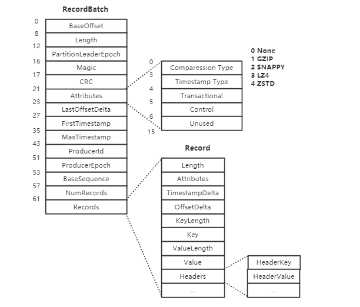

# 消息

消息是 Kafka 中流通的数据，生产者客户端将业务生成的消息包装成 `ProducerRecord` 后转换成特定的格式发送到集群，集群接收到消息后追加到 Log 并持久化到磁盘，消费者客户端从集群拉取到消息数据后转换成 `ConsumerRecord` 给下游业务使用。


## 消息格式

消息在 Kafka 中是以批量的方式传输，`RecordBatch` 定义了消息批量传输的格式，每个 `RecordBatch` 由定长的头信息和变长的 `Record` 信息组成。

<center>


</center>


```
RecordBatch =>
  BaseOffset => Int64                 RecordBatch 的基准偏移，追加到日志时确定
  Length => Int32                     从 PartitionLeaderEpoch 开始的字节长度
  PartitionLeaderEpoch => Int32       leader 的选举次数，追加到日志时确定
  Magic => Int8                       消息格式版本号
  CRC => Uint32                       从 Attributes 开始的所有数据的校验和
  Attributes => Int16                 RecordBatch 的属性
  LastOffsetDelta => Int32            最后一个 Record 相对 BaseOffset 的差值
  FirstTimestamp => Int64             第一个 Record 的时间戳
  MaxTimestamp => Int64               RecordBatch 中最大的时间戳
  ProducerId => Int64                 生产者 Id，默认 -1
  ProducerEpoch => Int16              用于支持幂等和事务，默认 -1
  BaseSequence => Int32               用于支持幂等和事务，默认 -1
  NumRecords => Int32                 Record 的数量
  Records => [Record]

Attribute =>
    bit 0-2             压缩类型
        0               NONE
        1               GZIP
        2               SNAPPY
        3               LZ4
        4               ZSTD
    bit 3               timestamp 类型：0-CreateTime，1-LogAppendTime
    bit 4               事务消息：0 表示非事务消息
    bit 5               是否是 ControlBatch：0 表示不是
    bit 6-15            未使用
```
如果 RecordBatch 的 Attribute 表示为 ControlBatch 则整个批次只包含一个称为 ControlRecord 的记录，ControlRecord 不会传到应用而是用于消费者过滤被 abort 的事务消息。
```
ControlBatch =>
  version: int16        0
  type: int16           0 表示 abort，1 表示 commit
```

`Record` 是消息在 Kafka 中传输的格式，生产者客户端发送的消息通过 `DefaultRecord#writeTo()` 方法转换成指定格式的 ByteBuffer，消费者客户端则通过 `DefaultRecord#readForm()` 方法将指定格式的 ByteBuffer 转换成 `ConsumerRecord`。
```
Record =>
  Length => Varint                          消息字节长度的变长编码
  Attributes => Int8                        消息属性，暂时未使用
  TimestampDelta => Varlong                 与 ProducerBatch 中第一个 Record 的 timstamp 的差值
  OffsetDelta => Varint                     和 BaseOffset 的相对偏移
  KeyLength => Varint                       Key 的长度，-1 表示没有 key
  Key => Bytes                              消息的 key
  ValueLength => Varint                     Value 的长度，-1 表示没有 value
  Value => Bytes                            消息的值
  Headers => [HeaderKey HeaderValue]
    HeaderKey => String
    HeaderValue => Bytes

Header =>
  headerKeyLength: varint
  headerKey: String
  headerValueLength: varint
  Value: byte[]
```

## 消息转换


ProducerRecord

ProducerBatch

DefaultRecordBatch

DefaultRecord

MemoryRecords

消息在内存中的形式，

ConsumerRecords

ConsumerRecord


// 消息转换成 DefaultRecord

Accumulator#tryAppend()  --> ProducerBatch  --> MemoryRecordsBuilder  --> DefaultRecord#writeTo()

```java
// 写消息

// 消息写入的起始位置
initialPosition = buffer.position()
// 写消息前为 Batch Header 流出空间
buffer.position(initialPosition + batchHeaderSizeInBytes)


// 写 Batch Header

// 消息的终止位置(一批消息)
pos = buffer.position()
// 准备写入 Batch Header
buffer.position(initialPosition)
// 计算 Batch Header + 消息的长度
sizeInBytes = pos-initialPosition
```

// 批量消息转换成 RecordBatch

Send#sendProduceRequest --> MemoryRecordsBuilder#build() ---> MemoryRecordsBuilder#close   -> MemoryRecordsBuilder#writeDefaultBatchHeader  ---> RecordBatch#writeHeader


使用 ```kafka-dump-log.sh``` 脚本可以查看日志的格式：
```shell
bin/kafka-dump-log.sh --files /kafka/log/file
```