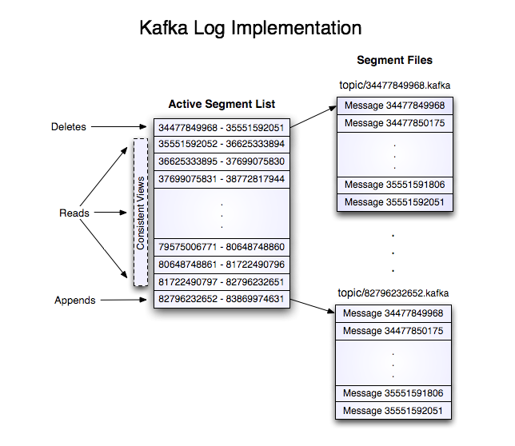

# 日志

消息在 Kafka 集群中以追加日志的方式存储，

Kafka 的消息在 broker 上以追加日志的形式存储，每个分区的每个副本在 broker 上都有各自的日志文件。日志文件位于 ```log.dirs``` 配置的目录下的 ```<topic>-<partitionId>``` 目录下。


broker 上的日志文件以及索引文件都是以基准偏移量(base offset)命名的，基准偏移量是一个 64 位的长整型数，表示当前日志文件中的第一条消息的 offset。


## Log


Log 是 kafka 日志的抽象，生产者向 broker 发送的消息是以 Log 的形式存储到文件中。Log 是一个 LogSegment 序列，每个 LogSegment 都有一个基准偏移量(base offset) 表示当前 LogSegment 中第一条消息的 offset。

Kafka 中消息不是一条一条的追加到日志文件中，而是以 ```RecordBatch``` 为单元追加的。消息在日志文件中是以二进制的形式存储的，

<center>


</center>


日志分段文件在一定条件会切分，相对应的索引文件也需要切分。日志分段文件切分包含以下一条即可触发切分：
- 当前日志分段文件的大小超过了 broker 端参数 ```log.segment.bytes``` 配置的值，默认是 1073741824(1GB)
- 当前日志分段中消息的最大时间戳与当前系统的时间戳的差值大于 ```log.roll.ms``` 或 ```log.roll.hours``` 参数配置的值(log.roll.ms 优先级大于 log.roll.hours)，默认情况下只配了 ```log.roll.hours``` 值为 168(7 天)
- 偏移量索引文件或时间戳索引文件的大小达到 broker 端参数 ```log.index.size.max.bytes``` 配置的值，默认是 10485760(10MB)
- 追加的消息的偏移量与当前日志分段的偏移量之间的差值大于 Integer.MAX_VALUE，即 ```offset - baseOffset > Integer.MAX_VALUE```


