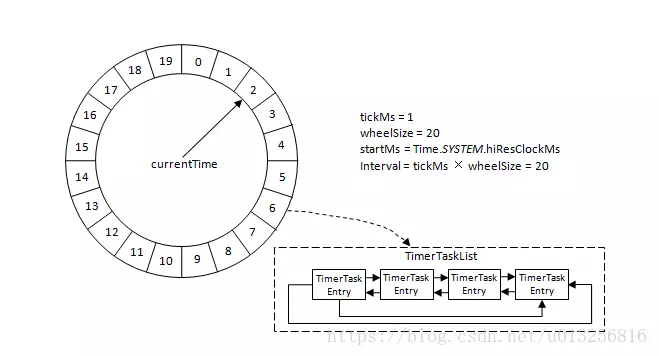

# KafkaScheduler

KafkaScheduler 是 Kafka broker 进程的任务调度模块，通过对 `ScheduledThreadPoolExecutor` 的封装，提供了对周期性和非周期性执行逻辑的调度。

KafkaScheduler 在 KafkaServer 启动时实例化，在创建 KafkaScheduler 时对 `ScheduledThreadPoolExecutor` 进行了封装：
```scala
override def startup(): Unit = {
  debug("Initializing task scheduler.")
  this synchronized {
    if(isStarted)
      throw new IllegalStateException("This scheduler has already been started!")
    executor = new ScheduledThreadPoolExecutor(threads)
    // 执行器 shutdown 之后不再执行周期任务
    executor.setContinueExistingPeriodicTasksAfterShutdownPolicy(false)
    // 执行器 shutdown 之后不再执行延迟任务
    executor.setExecuteExistingDelayedTasksAfterShutdownPolicy(false)
    // Task cancel 之后从队列中移除
    executor.setRemoveOnCancelPolicy(true)
    executor.setThreadFactory(new ThreadFactory() {
                              def newThread(runnable: Runnable): Thread = 
                                new KafkaThread(threadNamePrefix + schedulerThreadId.getAndIncrement(), runnable, daemon)
                            })
  }
}
```
KafkaScheduler 在 Broker 的多个模块中应用，包括日志管理(LogManager)、副本管理(ReplicaManager)等。

## Timer
除了通过 KafkaScheduler 调度周期任务和非周期任务外，Kafka 还通过时间轮算法实现了定时器 Timer 用于在指定的延时执行任务。

`SystemTimer` 是 Kafka 提供的定时器实现类，内部封装了时间轮 `TimingWheel`，提供了添加延迟任务以及推动时间轮的方法，并在任务到期时执行。
```scala
// 延时到达的任务执行器
private[this] val taskExecutor = Executors.newFixedThreadPool(1, new ThreadFactory() {
def newThread(runnable: Runnable): Thread =
  KafkaThread.nonDaemon("executor-"+executorName, runnable)
})
// 推动时间轮前进
private[this] val delayQueue = new DelayQueue[TimerTaskList]()
// 时间轮
private[this] val timingWheel = new TimingWheel(
  tickMs = tickMs,
  wheelSize = wheelSize,
  startMs = startMs,
  taskCounter = taskCounter,
  delayQueue
)

// 添加任务到时间轮，如果任务到期则执行
private def addTimerTaskEntry(timerTaskEntry: TimerTaskEntry): Unit = {
  if (!timingWheel.add(timerTaskEntry)) {
    // Already expired or cancelled
    if (!timerTaskEntry.cancelled)
      taskExecutor.submit(timerTaskEntry.timerTask)
  }
}

// 推进时间轮
def advanceClock(timeoutMs: Long): Boolean = {
    // 时间轮中的 bucket 会存放到延迟队列中
    var bucket = delayQueue.poll(timeoutMs, TimeUnit.MILLISECONDS)
    if (bucket != null) {
      writeLock.lock()
      try {
        while (bucket != null) {
          // 时间轮推进，如果有延迟任务到期
          timingWheel.advanceClock(bucket.getExpiration())
          bucket.flush(reinsert)
          bucket = delayQueue.poll()
        }
      } finally {
        writeLock.unlock()
      }
      true
    } else {
      false
    }
  }
```

### 时间轮算法

Kafka 采用时间轮算法使得 `SystemTimer` 的插入和删除复杂度为 O(1)，相比 `java.util.concurrent.DelayQueue` 和 `java.util.Timer` 等基于最小堆实现时插入和删除为 log(N) 的时间复杂度有了巨大的提升。

Kafka 中的时间轮(TimingWheel)是一个存储定时任务的环形队列，底层采用数组实现，数组中的每个元素可以存放一个定时任务列表(TimeTaskList)，任务列表是一个环形的双向链表，链表中的每一项表示的是定时任务项(TimeTaskEntry)，其中封装了真正的定时任务(TimeTask)。



时间轮是由多个时间格组成的环形列表，每个时间格称为桶(bucket)，每个中保存着对应时间跨度(tickMs)范围内的任务，因此整个时间轮的时间跨度(interval) 为 `tickMs * wheelSize`。时间轮有一个表盘指针(currentTime)表示时间轮当前所处的时间，currentTime 可以将整个时间轮划分为到期部分和未到期部分，currentTime 当前指向的时间格表示刚好到期，需要处理此时间格所对应 TimerTaskList 中所有的任务。

```scala
private[timer] class TimingWheel(tickMs: Long, wheelSize: Int, startMs: Long, taskCounter: AtomicInteger, queue: DelayQueue[TimerTaskList]) {
  // 单层时间轮的跨度
  private[this] val interval = tickMs * wheelSize
  // 时间轮划分为 wheelSize 个 bucket，每个 bucket 中存放着由 TimerTaskList 维护的延迟任务双向链表
  private[this] val buckets = Array.tabulate[TimerTaskList](wheelSize) { _ => new TimerTaskList(taskCounter) }
  // 时间轮的当前时间
  private[this] var currentTime = startMs - (startMs % tickMs) // rounding down to multiple of tickMs

  // overflowWheel can potentially be updated and read by two concurrent threads through add().
  // Therefore, it needs to be volatile due to the issue of Double-Checked Locking pattern with JVM
  @volatile private[this] var overflowWheel: TimingWheel = null

  // ...
}
```
当时间轮的当前时间(currentTime)到达 bucket 的结束时间时，整个 bucket 就会到期，其中维护的延迟任务就会执行。为了保证延时的精度，bucket 的时间范围不能设置的过于大，因此单层时间轮表示的延时范围有限，当添加的延迟任务延迟时间超出单层时间轮的范围时则会溢出。

层级时间轮(hierarchical timing wheel)能够很好的处理延迟时间溢出的问题，每层时间轮的 bucket 时间跨度是其下层时间轮的时间跨度。当插入的延迟任务延迟超过当层时间轮的 interval 时则交由下一层的时间轮处理，当上层时间轮的 bucket 时间跨度到达时就将 bucket 中的所欲延迟任务重新添加到下层时间轮中。

```scala
// 添加延迟任务到时间轮
def add(timerTaskEntry: TimerTaskEntry): Boolean = {
    val expiration = timerTaskEntry.expirationMs

    if (timerTaskEntry.cancelled) {
      // Cancelled
      false
    // 当前 bucket 已经到期，不再插入任务
    } else if (expiration < currentTime + tickMs) {
      // Already expired
      false
    // 延迟任务的延迟时间在当层时间轮时间跨度内
    } else if (expiration < currentTime + interval) {
      // Put in its own bucket
      val virtualId = expiration / tickMs
      // 计算延迟任务属于的 bucket
      val bucket = buckets((virtualId % wheelSize.toLong).toInt)
      bucket.add(timerTaskEntry)

      // bucket 过期时间不想等则说明初次入队或者由于时间轮推进之前入队的 bucket 已经到期执行完需要重新入队
      // Set the bucket expiration time
      if (bucket.setExpiration(virtualId * tickMs)) {
        // The bucket needs to be enqueued because it was an expired bucket
        // We only need to enqueue the bucket when its expiration time has changed, i.e. the wheel has advanced
        // and the previous buckets gets reused; further calls to set the expiration within the same wheel cycle
        // will pass in the same value and hence return false, thus the bucket with the same expiration will not
        // be enqueued multiple times.
        queue.offer(bucket)
      }
      true
    } else {
      // Out of the interval. Put it into the parent timer
      if (overflowWheel == null) addOverflowWheel()
      overflowWheel.add(timerTaskEntry)
    }
}
```
时间轮的推进则采用了 DelayQueue 实现，`SystemTimer` 的 `advanceClock` 方法用于推进时间轮，通过不断从 DelayQueue 中获取 TimerTaskList 并根据其过期时间推进时间轮，并通过将其中所有的 TimerTaskEntry(已经到期)重新加入时间轮触发过期执行，并在处理完所有 TimerTaskEntry 后将其过期时间还原用于后续重用。
```scala
// SystemTimer
def advanceClock(timeoutMs: Long): Boolean = {
  // 所偶的 bucket 都会加入 DelayQueue
  var bucket = delayQueue.poll(timeoutMs, TimeUnit.MILLISECONDS)
  if (bucket != null) {
    writeLock.lock()
    try {
      while (bucket != null) {
        // 推进时间轮的当前时间
        timingWheel.advanceClock(bucket.getExpiration())
        // 将当前 bucket 中的所有延迟任务通过重新加入时间轮的方式触发执行，并在执行完之后出重置当前 bucket 的过期时间用于重用
        // 多级时间轮中 bucket 的 TimerTaskEntry 在重新加入时间轮时自动添加到低层级的时间轮中
        bucket.flush(reinsert)
        bucket = delayQueue.poll()
      }
    } finally {
      writeLock.unlock()
    }
    true
  } else {
    false
  }
}

// TimingWheel，更新各层时间轮的当前时间
def advanceClock(timeMs: Long): Unit = {
  if (timeMs >= currentTime + tickMs) {
    currentTime = timeMs - (timeMs % tickMs)

    // Try to advance the clock of the overflow wheel if present
    if (overflowWheel != null) overflowWheel.advanceClock(currentTime)
  }
}

// TimerTaskList
// Remove all task entries and apply the supplied function to each of them
def flush(f: (TimerTaskEntry)=>Unit): Unit = {
  synchronized {
    var head = root.next
    while (head ne root) {
      remove(head)
      f(head)
      head = root.next
    }
    expiration.set(-1L)
  }
}
```

### DelayedOperation

Kafka 使用 `DelayedOperation` 表示延迟操作，`onComplete()` 方法定义具体的延迟操作，并仅被调用一次，执行完之后 `isCompleted()` 方法返回 true。onComplete（）可以由forceComplete（）触发，forceComplete（）在delayMs之后强制调用onComplete（），如果操作尚未完成，tryComplete（）则首先检查操作是否可以完成，如果是，则调用forceComplete（）。
```scala
// 延迟操作的具体执行逻辑，在 forceComplete 方法中被调用，保证只会被调用一次
def onComplete(): Unit

// 检查延迟操作是否可以执行，如果可以则调用 forceComplete
def tryComplete(): Boolean

// 延迟操作执行完后的回调方法
def onExpiration(): Unit

// 强制执行延迟操作，如果延迟操作需要执行则从时间轮中取消并且调用 onComplete 方法执行，方法通过 CAS 的方式保证只会有一个线程执行延迟操作
def forceComplete(): Boolean
```
延迟任务在到期后会从时间轮中取出交由线程池执行，`DelayedOperation` 实现了 `Runnable` 接口，在 run 方法中定义了d延迟操作到期时的执行：
```scala
override def run(): Unit = {
  if (forceComplete())
    onExpiration()
}
```

### DelayedOperationPurgatory

`DelayedOperationPurgatory` 是 Kafka 提供的管理 `DelayedOperation` 的组件，包含了两个重要的属性：
- timeoutTimer
-

- TimingWheel 在创建的时候以当前系统时间为第一层时间轮的起始时间(startMs)
- TimingWheel 中的每个双向环形链表 TimerTaskList 都会有一个哨兵节点(sentinel)，引入哨兵节点可以简化边界条件
- 除了第一层时间轮，其余高层时间轮的起始时间(startMs)都设置为创建此层时间轮前面第一轮 currentTime。每一层的 currentTime 都必须是 tickMs 的整数倍，如果不满足则会将 currentTime 修剪为 tickMs 的整数倍，以此与时间轮中的时间格的到期时间规范对应起来，修剪的方式为 currentTime = startMs - (startMs % tickMs)。
- Kafka 中的定时器之需持有 TimingWheel 的第一层时间轮的引用，并不会直接持有其他高层的时间轮，但每一层时间轮都会有一个引用(overflowWheel)指向更高一层的引用，以此层级调用可以实现定时器间接持有各个层级时间轮的引用

Kafka 中的定时器使用了 JDK 中的 DelayQueue 来协助推进时间轮。具体的做法是对于每个使用到的 TimerTaskList 都加入 DelayQueue，然后使用一个名为 ExpiredOperationReaper 的线程获取 DelayQueue 中到期的任务列表，当获取到 TimerTaskList 之后可以根据对应的 expiration 来推进时间轮也可以执行 TimerTaskList 相应的操作。

Kafka 中的 TimingWheel 专门负责执行插入和删除 TimerTaskEntry 的操作，而 DelayQueue 专门负责时间推进的任务。

### 延时操作
如果生产者发送消息时的 ack 参数设置为 all 时，需要 ISR 中所有的副本都确认收到消息之后才能收到响应结果，否则获取超时异常，生产者请求超时由参数 ```request.timeout.ms``` 配置，默认 30000。

在将消息写入 leader 副本的日志文件之后，Kafka 会创建一个延时的生产操作(DelayedProduce)用来处理消息正常写入所有副本或超时的情况并返回相应的结果给客户端。

Kafka 中多种延时操作，延时操作需要延时返回响应结果，因此需要一个超时时间(delayMs)，如果在超时时间内没有完成任务那么需要强制完成以返回响应结果给客户端；延时操作不同于定时操作，可以在所设定的超时时间之前完成，所以延时操作能够支持外部事件的触发。

延时操作创建之后会被加入延时操作管理器(DelayedOperationPurgatory)来做专门的处理，延时操作有可能会超时，每个延时操作管理器都会配备一个定时器(SystemTimer)来做超时管理，定时器的底层采用时间轮实现。延时操作需要支持外部事件的触发，因此配备一个监听池来负责监听每个分区的外部事件。

#### 延时生产
对于生产延时(DelayedProduce) 而言它的外部事件是写入消息的某个分区的 HW 发生增长，也就是说随着 follower 副本不断地与 leader 副本进行同步进而促使 HW 进一步增长，HW 每增长一次都会检测是否能够完成此次延时生产操作，如果可以就执行以此返回响应结果给客户端，如果在超时时间内始终无法完成，则强制执行。如果客户端设置的 acks 参数不为 all，或者没有成功的消息写入，那么就直接返回结果给客户端，否则就需要创建延时生产操作并存入延时操作管理器，最终要么由外部事件触发，要么由超时触发而执行。
#### 延时拉取
Kafka 在处理拉取请求时，会先读取一次日志文件，如果收集不到足够多(fetchMinBytes，由参数 fetch.min.bytes 设置，默认为 1)的消息，那么就会创建一个延时拉取操作(DelayedFetch)以等待拉取到足够数量的消息。当延时拉取操作执行时会再读取一次日志文件，然后将拉取的结果返回给 follower 副本。延时拉取操作也会有一个专门的延时操作管理器负责管理，如果拉取进度一直没有追赶上 leader 副本，那么在拉取 leader 副本的消息时一般拉取的消息大小都会不小于 fetchMinBytes。延时拉取操作同样是由超时触发或外部事件触发而被执行的，超时触发是等到超时时间之后触发第二次读取日志文件的操作。


https://my.oschina.net/anur/blog/2252539

https://www.jianshu.com/p/605268a19d94