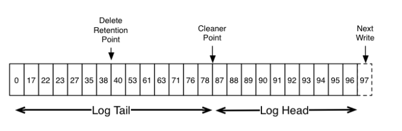

## 日志

Kafka 通过日志持久化消息，主题的每个分区都有对应的日志。日志在磁盘中以目录的形式存在，目录的地址由参数 `log.dir` 指定，目录的名称为 `<topic>-<partition>`，每个目录有多个存储消息数据的日志文件。

```
集群主题比较多，分区比较多是会导致文件很多，消息写入的时候写入多个文件夹，不再是顺序写了
```


日志由多个 `LogSegment` 组成，其中只有最后一个 `LogSegment` 允许追加消息数据，每个 `LogSegment` 在分区目录中对应一个日志文件，每个 `LogSegment` 将追加到其中的第一个消息的 `offset` 作为日志文件的名称。

`LogSegment` 达到阈值后就变成只读状态，并且创建新的 `LogSegment` 用于消息的追加，满足下列任意条件都会触发 `LogSegment` 的滚动：

- 当前日志分段大小超过参数 `log.segment.bytes` 设置的值，默认为 1073741824(1GB)
- 日志分段中消息的最大时间戳与当前系统的时间戳差值大于 `log.roll.ms` 或者 `log.roll.hours` 的值，优先使用 `log.roll.ms` 设置的值，默认只设置了 `log.roll.hours` 为 168，即 7 天
- 日志分段对应的偏移量索引文件或时间戳索引文件的大小达到参数 `log.index.size.max.bytes` 配置的值，默认是 10485760(10MB)
- 追加的消息的偏移量与当前日志分段的偏移量(日志分段中第一个消息的偏移量)之间的差值大于 Integer.MAX_VALUE，即 `offset - baseOffset > Integer.MAX_VALUE`

```scala
val segment = maybeRoll(messagesSize = validRecords.sizeInBytes,
  maxTimestampInMessages = appendInfo.maxTimestamp,
  maxOffsetInMessages = appendInfo.lastOffset)


private def maybeRoll(messagesSize: Int, maxTimestampInMessages: Long, maxOffsetInMessages: Long): LogSegment = {
  val segment = activeSegment
  val now = time.milliseconds
  val reachedRollMs = segment.timeWaitedForRoll(now, maxTimestampInMessages) > config.segmentMs - segment.rollJitterMs
  if (segment.size > config.segmentSize - messagesSize ||
      (segment.size > 0 && reachedRollMs) ||
      segment.index.isFull || segment.timeIndex.isFull || !segment.canConvertToRelativeOffset(maxOffsetInMessages)) {
    roll(maxOffsetInMessages - Integer.MAX_VALUE)
  } else {
    segment
  }
}
```
Kafka 使用 `MMAP` 零拷贝技术来减少数据写磁盘时的性能损耗，消息在写入 `LogSegment` 之后并不会立即刷盘，而是由操作系统具体执行刷盘任务。因此在消息写入后有可能会因为 broker 所在机器异常导致数据丢失，Kafka 提供了控制数据刷盘的参数 `log.flush.interval.message` 和 `log.flush.interval.ms` 分别可以在积累一定量的消息数据后刷盘或者间隔指定时间后刷盘。


### 日志清理

Kafka 为了控制磁盘空间的占用率会对消息进行清理操作，Kafka 提供了两种日志清理策略：
- `Log Retention`：按照保留策略直接删除不符合条件的日志分段
- `Log Compaction`：针对每个消息的 key 进行整合，对于有相同 key 的不同 value 值只保留最后一个版本

Kafka 提供参数 `log.cleanup.policy` 设置日志清理策略，默认是 `delete`，即采用日志删除的清理策略，如果需要采用 `Log Compaction` 策略则需要将参数设置为 `compact` 并将参数 `log.cleaner.enable` 设置为 true。通过设置 `log.cleanup.policy` 为 `delete,compact` 可以同时开启日志删除和日志压缩两种策略。

`Broker` 启动时会创建 `LogManager` 用于日志文件的管理，`LogMananger` 在启动时创建 `kafka-log-retention` 线程以参数 `log.retention.check.interval.ms` 设置的时间(默认 300000，即 300s) 为周期检测日志文件并删除不符合保留条件的日志文件。

`LogManager` 在启动时会启动 `LogCleaner` 用于执行日志压缩，`LogCleaner` 会创建 `kafka-log-cleaner-thread` 线程用于日志压缩。


#### 日志删除
日志删除策略会删除不符合保留条件的日志分段，日志分段满足任意条件则认为需要删除：
- 日志分段中的最大时间戳和当前时间的差值大于参数 `log.retention.ms` 设置的值，也就是说该日志分段中的所有消息都超过了设置的生存时间，默认生存时间设置为 7 天
- 分区日志的总大小超过 `log.retention.bytes` 则需要从最开始的日志分段开始删除，直到分区日志总大小不超过指定的值，也就是分区日志的大小需要不大于需要保留的数据量，默认是 -1 表示保留所有的数据
- 下一个日志分段的偏移量 (`baseOffset`) 小于等于日志的偏移量 (`logStartOffset`，日志保留的第一个消息的偏移量)  则说明当前日志分段已经对消费者不可见，需要被删除 

```scala
def deleteOldSegments(): Int = {
  if (!config.delete) return 0
  deleteRetentionMsBreachedSegments() + deleteRetentionSizeBreachedSegments() + deleteLogStartOffsetBreachedSegments()
}

// 删除超过保留时间的日志分段
private def deleteRetentionMsBreachedSegments(): Int = {
  if (config.retentionMs < 0) return 0
  val startMs = time.milliseconds
  // largestTimestamp 在每次写数据时更新为当前最大的时间戳
  // 当前时间 - largestTimestamp 即表示 Segment 中最新的数据的保留时间
  deleteOldSegments((segment, _) => startMs - segment.largestTimestamp > config.retentionMs,
    reason = s"retention time ${config.retentionMs}ms breach")
}

// 删除超过日志保留大小的日志分段
private def deleteRetentionSizeBreachedSegments(): Int = {
  if (config.retentionSize < 0 || size < config.retentionSize) return 0
  // 计算 Log 总大小和 retensionSize 的差值
  var diff = size - config.retentionSize
  def shouldDelete(segment: LogSegment, nextSegmentOpt: Option[LogSegment]) = {
    // 如果 LogSegment 大小小于差值则需要清理
    if (diff - segment.size >= 0) {
      diff -= segment.size
      true
    } else {
      false
    }
  }
  deleteOldSegments(shouldDelete, reason = s"retention size in bytes ${config.retentionSize} breach")
}

// 删除不可见的日志分段
private def deleteLogStartOffsetBreachedSegments(): Int = {
  def shouldDelete(segment: LogSegment, nextSegmentOpt: Option[LogSegment]) =
    nextSegmentOpt.exists(_.baseOffset <= logStartOffset)

  deleteOldSegments(shouldDelete, reason = s"log start offset $logStartOffset breach")
}
```
满足日志删除策略的日志分段并不会全部删除，

日志删除策略确定的 LogSegment 除了需要满足策略外，还需要满足删除的 LogSegment 中的消息的 offset 是小于 Log 的 HW 的，并且删除的 LogSegment 不能是 Log 的最后一个 LogSegment。

```scala
private def deleteOldSegments(predicate: (LogSegment, Option[LogSegment]) => Boolean, reason: String): Int = {
  lock synchronized {
    val deletable = deletableSegments(predicate)
    if (deletable.nonEmpty)
      info(s"Found deletable segments with base offsets [${deletable.map(_.baseOffset).mkString(",")}] due to $reason")
    deleteSegments(deletable)
  }
}

private def deletableSegments(predicate: (LogSegment, Option[LogSegment]) => Boolean): Iterable[LogSegment] = {
  if (segments.isEmpty) {
    Seq.empty
  } else {
    val deletable = ArrayBuffer.empty[LogSegment]
    var segmentEntry = segments.firstEntry
    while (segmentEntry != null) {
      val segment = segmentEntry.getValue
      val nextSegmentEntry = segments.higherEntry(segmentEntry.getKey)
      val (nextSegment, upperBoundOffset, isLastSegmentAndEmpty) = if (nextSegmentEntry != null)
        (nextSegmentEntry.getValue, nextSegmentEntry.getValue.baseOffset, false)
      else
        (null, logEndOffset, segment.size == 0)

      if (highWatermark >= upperBoundOffset && predicate(segment, Option(nextSegment)) && !isLastSegmentAndEmpty) {
        deletable += segment
        segmentEntry = nextSegmentEntry
      } else {
        segmentEntry = null
      }
    }
    deletable
  }
}
```
确定了需要删除的 LogSegment 之后就可以删除过期的 LogSegment，删除之前需要保证 Log 中最少有一个 LogSegment，因此当需要删除的 LogSegment 数量等于 Log 中 LogSegment 数量时会再创建出一个 LogSegment。

```java
private def deleteSegments(deletable: Iterable[LogSegment]): Int = {
  maybeHandleIOException(s"Error while deleting segments for $topicPartition in dir ${dir.getParent}") {
    val numToDelete = deletable.size
    if (numToDelete > 0) {
      // we must always have at least one segment, so if we are going to delete all the segments, create a new one first
      if (segments.size == numToDelete)
        roll()
      lock synchronized {
        checkIfMemoryMappedBufferClosed()
        // remove the segments for lookups
        removeAndDeleteSegments(deletable, asyncDelete = true)
        // 调整日志的 LogStartOffset
        maybeIncrementLogStartOffset(segments.firstEntry.getValue.baseOffset)
      }
    }
    numToDelete
  }
}
```
删除过期的 LogSegmenet 操作首先从 Log 对象中维护的 LogSegment 的跳跃表中移除待删除的 LogSegment，保证没有线程对这些分段进行读取操作，然后将 LogSegment 对应的所有文件(日志文件和索引文件)添加 ```.delete``` 后缀，最后通过一个名为 ```delete-file``` 的延迟任务删除这些文件，任务的延迟时间由参数 ```file.delete.delay.ms``` 设置，默认是 60000。

```java
// Log#removeAndDeleteSegments

private def removeAndDeleteSegments(segments: Iterable[LogSegment], asyncDelete: Boolean): Unit = {
  lock synchronized {
    // As most callers hold an iterator into the `segments` collection and `removeAndDeleteSegment` mutates it by
    // removing the deleted segment, we should force materialization of the iterator here, so that results of the
    // iteration remain valid and deterministic.
    val toDelete = segments.toList
    // 从 Log 中维护的跳跃表中移除
    toDelete.foreach { segment =>
      this.segments.remove(segment.baseOffset)
    }
    // 删除对应的文件
    deleteSegmentFiles(toDelete, asyncDelete)
  }
}


// Log#deleteSegmentFiles

private def deleteSegmentFiles(segments: Iterable[LogSegment], asyncDelete: Boolean): Unit = {
  segments.foreach(_.changeFileSuffixes("", Log.DeletedFileSuffix))

  def deleteSegments(): Unit = {
    info(s"Deleting segments $segments")
    maybeHandleIOException(s"Error while deleting segments for $topicPartition in dir ${dir.getParent}") {
      segments.foreach(_.deleteIfExists())
    }
  }

  if (asyncDelete) {
    info(s"Scheduling segments for deletion $segments")
    scheduler.schedule("delete-file", () => deleteSegments, delay = config.fileDeleteDelayMs)
  } else {
    deleteSegments()
  }
}
```

#### 日志压缩

日志压缩 (`Log Compaction`) 操作保证 Kafka 在单个主题分区的数据日志中只保留相同 key 的消息最后的值。日志的 compaction 机制是基于记录的，可以在创建主题时通过参数 `log.cleaner.enable` 设置是否开启，默认情况下所有的主题都是开启的。




日志压缩是由 `LogMananger` 创建的 `LogCleaner` 完成，`LogCleaner` 创建参数 `log.cleaner.threads` 指定的线程(默认 1)来处理日志压缩。

日志压缩先筛选出需要进行压缩的日志分段，kafka 日志存储目录中的 `cleaner-offset-checkoupoint` 文件记录了当前分区已经清理过的 `offset`，因此可以将整个分区日志划分为两部分。


Kafka 日志存储目录内有 ```cleaner-offset-checkpoint``` 文件记录当前分区中已经清理的 offset，通过这个文件可以将 Log 分为已经清理过的部分和未清理的部分。然后在 ```LogCleanerManager#cleanableOffsets``` 方法中在未清理的部分中定位可以清理的范围 ```[firstDirtyOffset, firstUnstableOffset)```。

定位可以清理的范围的时候需要排除 activeSegment，同时可以设置参数 ```log.cleaner.min.compaction.lag.ms``` 来配置消息在清理前最小的保留时间来排除消息所在的 Segment。

```LogCleannerManager#grabFilthiestCompactedLog``` 方法对定位的 offset 范围再次过滤，过滤掉  ```cleanableRatio``` 小于参数 ```log.cleaner.min.cleanable.ratio``` 设置的值的 LogSegment，默认为 0.5。 最后选出 ```cleanableRatio``` 最高的 Log 进行清理：

```java
// LogCleannerManager#grabFilthiestCompactedLog

val cleanableLogs = dirtyLogs.filter { ltc => 
  (ltc.needCompactionNow && ltc.cleanableBytes > 0) || ltc.cleanableRatio > ltc.log.config.minCleanableRatio
  // 计算 celanableRatio 并排除掉小于 log.cleaner.min.cleanable.ratio 的 LogSegment
}
if(cleanableLogs.isEmpty) {
  None
} else {
  preCleanStats.recordCleanablePartitions(cleanableLogs.size)
  // 清理 celanableRatio 最大的 LogSegment
  val filthiest = cleanableLogs.max
  inProgress.put(filthiest.topicPartition, LogCleaningInProgress)
  Some(filthiest)
}


// LogCleaner

// firstDirtyOffset 之前的 LogSegment 的大小之和
val cleanBytes = log.logSegments(-1, firstDirtyOffset).map(_.size.toLong).sum
// 可清理的 LogSegment 的大小之和
val (firstUncleanableOffset, cleanableBytes) = LogCleanerManager.calculateCleanableBytes(log, firstDirtyOffset, uncleanableOffset)
val totalBytes = cleanBytes + cleanableBytes
val cleanableRatio = cleanableBytes / totalBytes.toDouble
```

LogCleaner 在创建 CleanerThread 线程清理日志时，每个日志清理线程都会创建一个 ```SkimpyOffsetMap``` 对象来映射日志中消息的 key 和 消息的 offset。日志清理线程需要遍历两次文件，第一次遍历把消息的 key 和 最后出现的 offset 保存在 ```SkimpyOffsetMap``` 对象中，第二次遍历会检查每个消息是否需要清理，如需要则清理。


默认情况下，SkimpyOffsetMap 使用 MD5 来计算 key 的哈希值，占用空间大小为 16B，根据这个哈希值来从 SkimpyOffsetMap 中找到对应的槽位，如果发生冲突则用线性探测法处理。为了防止哈希冲突过于频繁，可以通过 ```log.cleaner.io.buffer.load.factor```(默认 0.9) 来调整负载因子。偏移量占用空间大小为 8B，因此一个映射项占用空间大小为 24B。

每个日志清理线程的 SkimpyOffsetMap 的内存占用大小为 ```log.cleaner.dedupe.buffer.size / log.cleaner```，默认情况下 SkimpyOffsetMap 可以保存 ```128M * 0.9/24B=5033164``` 个 key 的记录。

#### 墓碑消息

Log Compaction 会保留 key 相应的最新 value 值，当需要删除一个 key 时 Kafka 提供了墓碑消息(tombstone)的概念，如果一条消息的 key 不为 null，但是其 value 为 null，那么此消息就是墓碑消息。

日志清理线程发现墓碑消息时会先进行常规的清理并保留墓碑消息一段时间，墓碑消息的保留条件是当前墓碑消息所在的日志分段的最近修改时间 lastModifiedTime 大于 deleteHorizonMs，这个 deleteHorizonMs 的计算方式为 clean 部分中最后一个日志分段的最近修改时间减去保留阈值 deleteRetionMs（通过 log.cleaner.delete.retention.ms 配置，默认值 86400000）

Log Compaction 执行过后的日志分段的大小会比原先的日志分段文件小，为了防止出现太多的小文件，Kafka 在实际清理过程中并不对单个日志分段文件进行单独清理，而是将日志分段文件中 offset 从 0 到 firstUncleanableOffset 的所有日志分段进行分组，每个日志分段属于一组，分组策略为：按照日志分段的顺序遍历，每组中日志分段的占用空间大小之和不能超过 segmentSize (通过 log.segment.bytes 设置，默认 1GB)，且对应的索引文件占用大小之和不超过 maxIndexSize（通过 log.index.interval.bytes 设置，默认 10MB）。同一个组的多个日志分段清理过后只会生成一个新的日志分段。

Log Compaction 过程中会将每个日志分组中需要保留的消息复制到一个以 .clean 为后缀的临时文件中，此临时文件以当前日志分组中第一个日志分段的文件命名，如 00000000000000000000.log.clean。Log Compaction 之后将 .clean 的文件修改为 .swap 后缀的文件，然后删除原本的日志文件，最后把文件的 .swap 后缀去掉

Log Compaction 执行前后日志分段中的每条消息的偏移量和写入时的偏移量保持一致，Log Compaction 会生成新的日志分段文件，日志分段中每条消息的物理地址会重新按照新文件来组织。Log Compaction 执行之后的偏移量不再是连续的，但是并不影响日志的查询。


https://segmentfault.com/a/1190000007922290

https://www.jianshu.com/p/59f1acb32832?utm_campaign=maleskine&utm_content=note&utm_medium=seo_notes&utm_source=recommendation